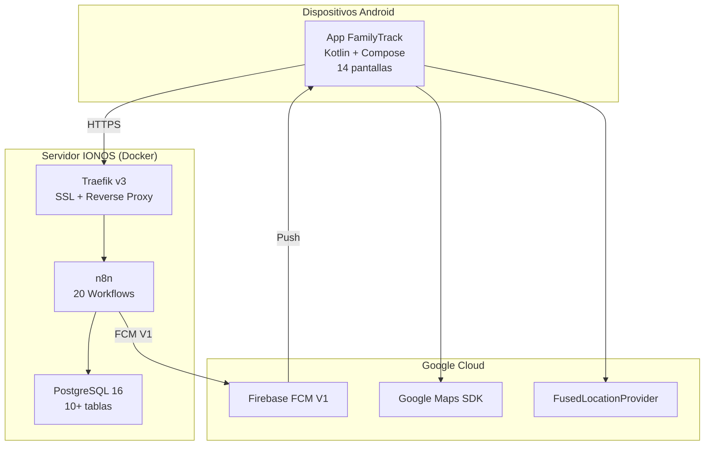
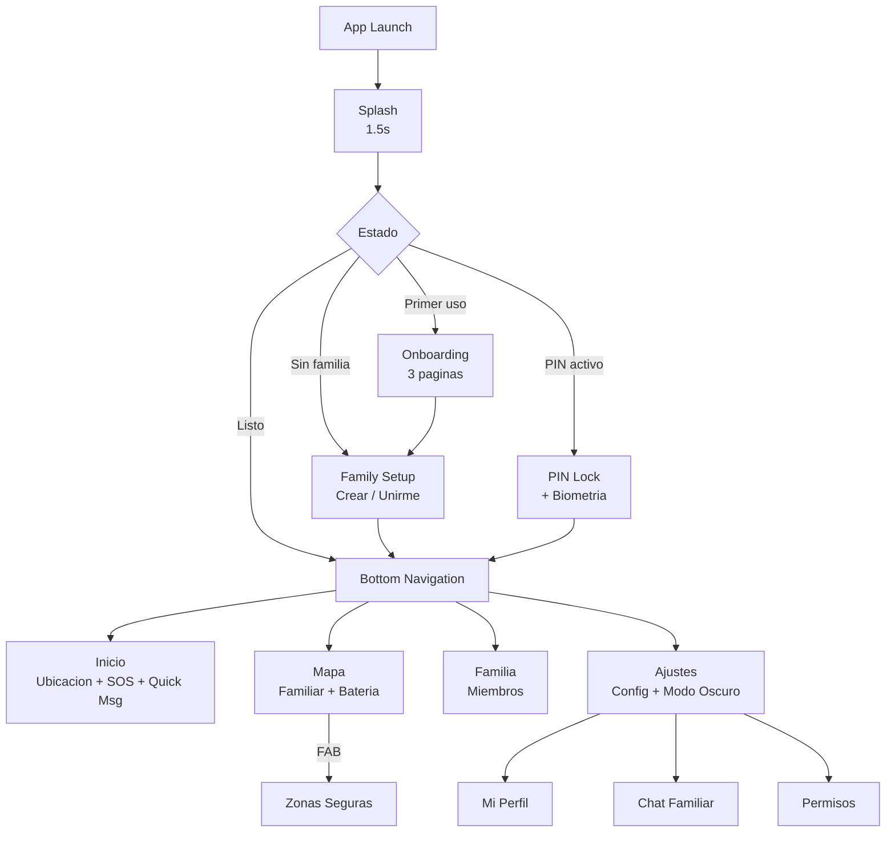

# FamilyTrack

Aplicacion Android de geolocalizacion familiar en tiempo real. Permite compartir ubicaciones entre miembros de una familia, definir zonas seguras con alertas automaticas, enviar notificaciones push, chat familiar, SOS de emergencia, historial de rutas y mucho mas.

---

## Funcionalidades

### v1.0 - Core

| # | Funcionalidad | Descripcion | Documentacion |
|---|---------------|-------------|---------------|
| 1 | **Firebase FCM** | Push notifications V1 (alertas zona, offline, manual) | [docs/features/01-firebase-fcm.md](docs/features/01-firebase-fcm.md) |
| 2 | **Backend n8n** | 20 workflows webhook + cron como backend serverless | [docs/features/02-n8n-backend.md](docs/features/02-n8n-backend.md) |
| 3 | **PostgreSQL** | Esquema relacional: 10+ tablas (usuarios, dispositivos, familias, mensajes, fotos) | [docs/features/03-postgresql.md](docs/features/03-postgresql.md) |
| 4 | **Android-Backend** | Retrofit + DTOs + Repositories + auto-registro | [docs/features/04-android-backend.md](docs/features/04-android-backend.md) |
| 5 | **Servicio ubicacion** | ForegroundService con GPS configurable 1-60 min | [docs/features/05-location-service.md](docs/features/05-location-service.md) |
| 6 | **Mapa familiar** | Google Maps con marcadores + zonas seguras como circulos | [docs/features/06-map-screen.md](docs/features/06-map-screen.md) |
| 7 | **Pantalla familia** | Lista de miembros con estado, roles y notificacion manual | [docs/features/07-family-screen.md](docs/features/07-family-screen.md) |
| 8 | **Zonas seguras** | CRUD de geofences con visualizacion en mapa | [docs/features/08-safe-zones.md](docs/features/08-safe-zones.md) |
| 9 | **Configuracion** | Ajustes de ubicacion, intervalo, dispositivo y acciones | [docs/features/09-settings-screen.md](docs/features/09-settings-screen.md) |
| 10 | **Backup n8n** | Backup diario automatico (cron 3AM, retencion 30 dias) | [docs/features/10-n8n-backup.md](docs/features/10-n8n-backup.md) |

### v2.0 - Features Avanzadas

| # | Funcionalidad | Descripcion | Documentacion |
|---|---------------|-------------|---------------|
| 11 | **Registro de familia** | Wizard crear/unirme a familia con codigo de invitacion | [docs/features/11-family-registration.md](docs/features/11-family-registration.md) |
| 12 | **PIN + Biometria** | Bloqueo por PIN 4 digitos + huella/rostro | [docs/features/12-pin-biometric.md](docs/features/12-pin-biometric.md) |
| 13 | **Edicion de perfil** | Nombre editable, rol, codigo de invitacion copiable | [docs/features/13-profile-editing.md](docs/features/13-profile-editing.md) |
| 14 | **Fotos familiares** | Envio de fotos con caption entre familiares | [docs/features/14-photo-sharing.md](docs/features/14-photo-sharing.md) |
| 15 | **Mensajes rapidos** | 5 chips predefinidos con envio de ubicacion | [docs/features/15-quick-messages.md](docs/features/15-quick-messages.md) |
| 16 | **Chat familiar** | Chat grupal con polling cada 10s | [docs/features/16-family-chat.md](docs/features/16-family-chat.md) |
| 17 | **SOS Emergencia** | Boton de panico con alerta push a toda la familia | [docs/features/17-sos-emergency.md](docs/features/17-sos-emergency.md) |
| 18 | **Historial de rutas** | Polyline en mapa con selector de fecha | [docs/features/18-route-history.md](docs/features/18-route-history.md) |
| 19 | **Monitor de bateria** | Nivel de bateria y estado de carga por familiar | [docs/features/19-battery-monitoring.md](docs/features/19-battery-monitoring.md) |
| 20 | **Modo oscuro** | 3 opciones: sistema, claro, oscuro | [docs/features/20-dark-mode.md](docs/features/20-dark-mode.md) |
| 21 | **Splash + Onboarding** | Pantalla de bienvenida + 3 paginas de introduccion | [docs/features/21-splash-onboarding.md](docs/features/21-splash-onboarding.md) |
| 22 | **Internacionalizacion** | 234 strings EN/ES con stringResource() | [docs/features/22-i18n-localization.md](docs/features/22-i18n-localization.md) |
| 23 | **Permisos mejorados** | Pantalla dedicada con 4 permisos y estados visuales | [docs/features/23-enhanced-permissions.md](docs/features/23-enhanced-permissions.md) |

---

## Arquitectura

> Documentacion completa con 15 diagramas Mermaid: **[docs/architecture.md](docs/architecture.md)**



### Stack Tecnologico

| Componente | Tecnologia |
|------------|------------|
| **App** | Kotlin, Jetpack Compose, Material 3, Hilt, Retrofit, DataStore |
| **Seguridad** | EncryptedSharedPreferences, BiometricPrompt, PIN SHA-256 |
| **Ubicacion** | FusedLocationProvider, ForegroundService, BatteryManager |
| **Mapas** | Google Maps SDK + Maps Compose + Polyline |
| **Notificaciones** | Firebase Cloud Messaging V1 |
| **Permisos** | Accompanist Permissions |
| **i18n** | stringResource() EN + ES (234 strings) |
| **Backend** | n8n (20 workflows webhook) |
| **Base de datos** | PostgreSQL 16 (10+ tablas) |
| **Infraestructura** | Docker, Traefik v3, Let's Encrypt |
| **Backup** | Cron + bash script (diario) |

---

## Estructura del Proyecto

```
familytrack/
├── app/src/main/java/com/monghit/familytrack/
│   ├── FamilyTrackApp.kt                 # Application + Hilt + NotificationChannels
│   ├── MainActivity.kt                   # Activity principal
│   ├── di/AppModule.kt                   # Hilt DI (Retrofit, Repositories)
│   ├── data/
│   │   ├── remote/
│   │   │   ├── ApiService.kt             # 20 endpoints Retrofit
│   │   │   └── dto/ApiDtos.kt            # 30+ DTOs request/response
│   │   └── repository/
│   │       ├── LocationRepository.kt     # Ubicaciones, familia, zonas
│   │       ├── SettingsRepository.kt     # DataStore preferences
│   │       └── SecurityRepository.kt     # PIN + biometria (EncryptedSharedPreferences)
│   ├── domain/model/                     # User, Device, Location, SafeZone, Alert, FamilyMember
│   ├── services/
│   │   ├── LocationForegroundService.kt  # GPS periodico + bateria
│   │   ├── FamilyTrackMessagingService.kt # FCM receiver
│   │   ├── BootReceiver.kt              # Auto-start en boot
│   │   └── BiometricHelper.kt           # BiometricPrompt wrapper
│   └── ui/
│       ├── navigation/                   # NavRoutes + NavHost + BottomBar (14 rutas)
│       ├── screens/
│       │   ├── splash/                   # Splash animado
│       │   ├── onboarding/               # 3 paginas de introduccion
│       │   ├── familysetup/              # Crear/Unirme a familia
│       │   ├── pin/                      # PIN + biometria
│       │   ├── home/                     # Mi Ubicacion + SOS + Quick Messages
│       │   ├── map/                      # Mapa Familiar
│       │   ├── family/                   # Mi Familia
│       │   ├── settings/                 # Ajustes + modo oscuro
│       │   ├── safezones/                # Zonas Seguras
│       │   ├── profile/                  # Mi Perfil
│       │   ├── chat/                     # Chat Familiar
│       │   ├── photos/                   # Fotos
│       │   ├── routehistory/             # Historial de Rutas
│       │   └── permissions/              # Permisos
│       └── theme/                        # Material 3 (light + dark)
├── app/src/main/res/
│   ├── values/strings.xml                # Strings EN (default)
│   └── values-es/strings.xml             # Strings ES
├── infra/
│   ├── docker-compose.yml                # PostgreSQL (produccion)
│   ├── init/                             # Schema SQL + datos seed
│   ├── n8n-workflows/                    # Workflows exportados (JSON)
│   └── n8n-backup/                       # Scripts de backup
└── docs/
    ├── architecture.md                   # 15 diagramas de arquitectura (Mermaid)
    ├── setup-guide.md                    # Guia completa de configuracion
    └── features/                         # 23 documentos de funcionalidad
        ├── 01-firebase-fcm.md ... 10-n8n-backup.md (v1.0)
        └── 11-family-registration.md ... 23-enhanced-permissions.md (v2.0)
```

**48 archivos Kotlin** | **14 pantallas** | **20 endpoints** | **3 repositorios** | **11 ViewModels**

---

## API Endpoints

**URL produccion:** `https://server.monghit.com/webhook/`

### v1.0 - Core

| Metodo | Endpoint | Descripcion |
|--------|----------|-------------|
| POST | `/api/register` | Registrar dispositivo (FCM token) |
| POST | `/api/location/update` | Enviar ubicacion + bateria + validar geofences |
| GET | `/api/family/locations` | Obtener ubicaciones familiares + zonas seguras |
| POST | `/api/config/location-interval` | Cambiar intervalo de reporte |
| POST | `/api/notify` | Notificacion manual entre familiares |
| POST | `/api/send-push` | Enviar push notification (FCM V1) |
| POST | `/api/safe-zones/create` | Crear zona segura |
| POST | `/api/safe-zones/delete` | Eliminar zona segura (soft-delete) |
| CRON | Cada 24h | Health check de dispositivos |

### v2.0 - Features Avanzadas

| Metodo | Endpoint | Descripcion |
|--------|----------|-------------|
| POST | `/api/family/create` | Crear familia (genera inviteCode 6 chars) |
| POST | `/api/family/join` | Unirse a familia con codigo de invitacion |
| POST | `/api/user/profile` | Obtener perfil de usuario |
| POST | `/api/user/update-profile` | Actualizar nombre y avatar |
| POST | `/api/quick-message` | Enviar mensaje rapido con ubicacion |
| POST | `/api/emergency` | Enviar alerta SOS a toda la familia |
| GET | `/api/locations/history` | Historial de ubicaciones por fecha |
| POST | `/api/chat/send` | Enviar mensaje al chat familiar |
| POST | `/api/chat/messages` | Obtener mensajes del chat familiar |
| POST | `/api/photos/send` | Enviar foto (base64) con caption |
| POST | `/api/photos/list` | Listar fotos recibidas |

---

## Configuracion Rapida

```bash
# 1. Clonar
git clone git@github.com:monghithub/familitrack.git
cd familitrack

# 2. Configurar Firebase
# Copiar google-services.json en app/ (con client debug)

# 3. Configurar local.properties
echo "sdk.dir=$HOME/Android/Sdk" > local.properties
echo "MAPS_API_KEY=tu_api_key" >> local.properties

# 4. Compilar
./gradlew assembleDebug

# 5. Instalar
adb install -t app/build/outputs/apk/debug/app-debug.apk
```

> Guia completa: **[docs/setup-guide.md](docs/setup-guide.md)**

---

## Requisitos

| Requisito | Version |
|-----------|---------|
| JDK | 17 (Corretto/OpenJDK) |
| Android SDK | 34 |
| Gradle | 8.7 |
| Android minimo | API 26 (Android 8.0) |
| Docker | 24+ (servidor) |
| PostgreSQL | 16 (servidor) |
| n8n | 2.2.4 (servidor) |

---

## Navegacion



---

## Licencia

Uso privado - Proyecto familiar
