# FamilyTrack

Aplicación Android de geolocalización familiar en tiempo real. Permite compartir ubicaciones entre miembros de una familia, definir zonas seguras con alertas automáticas y enviar notificaciones push.

---

## Funcionalidades

| # | Funcionalidad | Descripción | Documentación |
|---|---------------|-------------|---------------|
| 1 | **Firebase FCM** | Push notifications V1 (alertas zona, offline, manual) | [docs/features/01-firebase-fcm.md](docs/features/01-firebase-fcm.md) |
| 2 | **Backend n8n** | 9 workflows webhook + cron como backend serverless | [docs/features/02-n8n-backend.md](docs/features/02-n8n-backend.md) |
| 3 | **PostgreSQL** | Esquema relacional: usuarios, dispositivos, ubicaciones, zonas | [docs/features/03-postgresql.md](docs/features/03-postgresql.md) |
| 4 | **Android-Backend** | Retrofit + DTOs + Repositories + auto-registro | [docs/features/04-android-backend.md](docs/features/04-android-backend.md) |
| 5 | **Servicio ubicación** | ForegroundService con GPS configurable 1-60 min | [docs/features/05-location-service.md](docs/features/05-location-service.md) |
| 6 | **Mapa familiar** | Google Maps con marcadores + zonas seguras como círculos | [docs/features/06-map-screen.md](docs/features/06-map-screen.md) |
| 7 | **Pantalla familia** | Lista de miembros con estado, roles y notificación manual | [docs/features/07-family-screen.md](docs/features/07-family-screen.md) |
| 8 | **Zonas seguras** | CRUD de geofences con visualización en mapa | [docs/features/08-safe-zones.md](docs/features/08-safe-zones.md) |
| 9 | **Configuración** | Ajustes de ubicación, intervalo, dispositivo y acciones | [docs/features/09-settings-screen.md](docs/features/09-settings-screen.md) |
| 10 | **Backup n8n** | Backup diario automático (cron 3AM, retención 30 días) | [docs/features/10-n8n-backup.md](docs/features/10-n8n-backup.md) |

---

## Arquitectura

> Documentación completa con diagramas Mermaid: **[docs/architecture.md](docs/architecture.md)**


### Stack Tecnológico

| Componente | Tecnología |
|------------|------------|
| **App** | Kotlin, Jetpack Compose, Material 3, Hilt, Retrofit, DataStore |
| **Ubicación** | FusedLocationProvider, ForegroundService |
| **Mapas** | Google Maps SDK + Maps Compose |
| **Notificaciones** | Firebase Cloud Messaging V1 |
| **Backend** | n8n (workflows webhook) |
| **Base de datos** | PostgreSQL 16 |
| **Infraestructura** | Docker, Traefik v3, Let's Encrypt |
| **Backup** | Cron + bash script (diario) |

---

## Estructura del Proyecto

```
familytrack/
├── app/src/main/java/com/monghit/familytrack/
│   ├── FamilyTrackApp.kt                 # Application + Hilt + NotificationChannels
│   ├── MainActivity.kt                   # Activity principal
│   ├── di/AppModule.kt                   # Hilt DI (Retrofit, Repositories)
│   ├── data/
│   │   ├── remote/
│   │   │   ├── ApiService.kt             # 7 endpoints Retrofit
│   │   │   └── dto/ApiDtos.kt            # 12 DTOs request/response
│   │   └── repository/
│   │       ├── LocationRepository.kt     # Ubicaciones, familia, zonas
│   │       └── SettingsRepository.kt     # DataStore preferences
│   ├── domain/model/                     # User, Device, Location, SafeZone, Alert
│   ├── services/
│   │   ├── LocationForegroundService.kt  # GPS periódico
│   │   ├── FamilyTrackMessagingService.kt # FCM receiver
│   │   └── BootReceiver.kt              # Auto-start en boot
│   └── ui/
│       ├── navigation/                   # NavHost + BottomBar
│       └── screens/
│           ├── home/                     # Mi Ubicación
│           ├── map/                      # Mapa Familiar
│           ├── family/                   # Mi Familia
│           ├── settings/                 # Ajustes
│           └── safezones/                # Zonas Seguras
├── infra/
│   ├── docker-compose.yml                # PostgreSQL (producción)
│   ├── init/                             # Schema SQL + datos seed
│   ├── n8n-workflows/                    # Workflows exportados (JSON)
│   └── n8n-backup/                       # Scripts de backup
└── docs/
    ├── architecture.md                   # Diagramas de arquitectura (Mermaid)
    ├── setup-guide.md                    # Guía completa de configuración
    └── features/                         # Documentación por funcionalidad
        ├── 01-firebase-fcm.md
        ├── 02-n8n-backend.md
        ├── 03-postgresql.md
        ├── 04-android-backend.md
        ├── 05-location-service.md
        ├── 06-map-screen.md
        ├── 07-family-screen.md
        ├── 08-safe-zones.md
        ├── 09-settings-screen.md
        └── 10-n8n-backup.md
```

---

## API Endpoints

**URL producción:** `https://server.monghit.com/webhook/`

| Método | Endpoint | Descripción |
|--------|----------|-------------|
| POST | `/api/register` | Registrar dispositivo (FCM token) |
| POST | `/api/location/update` | Enviar ubicación + validar geofences |
| GET | `/api/family/locations` | Obtener ubicaciones familiares + zonas seguras |
| POST | `/api/config/location-interval` | Cambiar intervalo de reporte |
| POST | `/api/notify` | Notificación manual entre familiares |
| POST | `/api/send-push` | Enviar push notification (FCM V1) |
| POST | `/api/safe-zones/create` | Crear zona segura |
| POST | `/api/safe-zones/delete` | Eliminar zona segura (soft-delete) |
| CRON | Cada 24h | Health check de dispositivos |

---

## Configuración Rápida

```bash
# 1. Clonar
git clone git@github.com:monghithub/familitrack.git
cd familitrack

# 2. Configurar Firebase
# Copiar google-services.json en app/ (con client debug)

# 3. Configurar local.properties
echo "sdk.dir=$HOME/Android/Sdk" > local.properties
echo "MAPS_API_KEY=tu_api_key" >> local.properties

# 4. Compilar
./gradlew assembleDebug

# 5. Instalar
adb install -t app/build/outputs/apk/debug/app-debug.apk
```

> Guía completa: **[docs/setup-guide.md](docs/setup-guide.md)**

---

## Requisitos

| Requisito | Versión |
|-----------|---------|
| JDK | 17 (Corretto/OpenJDK) |
| Android SDK | 34 |
| Gradle | 8.7 |
| Android mínimo | API 26 (Android 8.0) |
| Docker | 24+ (servidor) |
| PostgreSQL | 16 (servidor) |
| n8n | 2.2.4 (servidor) |

---

## Navegación

```mermaid
graph TD
    APP[App Launch] --> NAV[Bottom Navigation]
    NAV --> HOME[🏠 Inicio<br/>Mi Ubicación]
    NAV --> MAP[🗺 Mapa<br/>Mapa Familiar]
    NAV --> FAM[👥 Familia<br/>Mi Familia]
    NAV --> SET[⚙️ Ajustes<br/>Configuración]
    MAP -->|Shield FAB| SZ[🛡 Zonas Seguras]
    SZ -->|Back| MAP
```



---

## Licencia

Uso privado - Proyecto familiar
