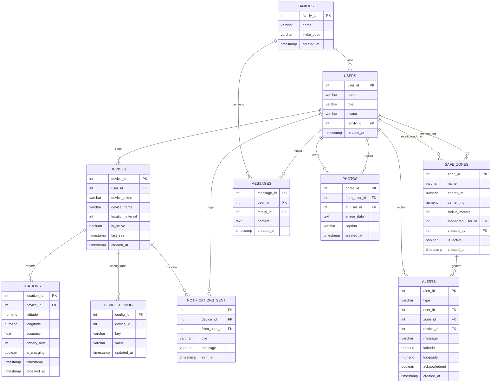

# Arquitectura de FamilyTrack

## Visión General

FamilyTrack es una aplicación de geolocalización familiar compuesta por una **app Android nativa** y un **backend serverless** basado en n8n + PostgreSQL, desplegado en Docker sobre un servidor IONOS.

**v2.0** incluye 14 pantallas, 20 endpoints/workflows, 10+ tablas de base de datos, autenticación por PIN/biometría, chat familiar, SOS de emergencia, historial de rutas, modo oscuro e internacionalización.

---

## Diagrama de Arquitectura General

---

## Arquitectura de la App Android

---

## Arquitectura del Backend (n8n + PostgreSQL)

---

## Diagrama de Secuencia: Registro de Dispositivo

---

## Diagrama de Secuencia: Envío de Ubicación

---

## Diagrama de Secuencia: Consulta de Ubicaciones Familiares

---

## Diagrama de Secuencia: Push Notification (FCM V1)

---

## Diagrama de Secuencia: Gestión de Zonas Seguras

---

## Diagrama de Secuencia: Backup Automático de n8n

---

## Diagrama de Secuencia: Registro de Familia (v2.0)

---

## Diagrama de Secuencia: Autenticación PIN + Biométrica (v2.0)

---

## Diagrama de Secuencia: Chat Familiar (v2.0)

---

## Diagrama de Secuencia: SOS de Emergencia (v2.0)

---

## Diagrama de Secuencia: Historial de Rutas (v2.0)

---

## Modelo de Datos (ER)

---

## Flujo de Navegación

---

## Stack Tecnológico Detallado

### App Android

| Capa | Tecnología | Versión |
|------|------------|---------|
| Lenguaje | Kotlin | 1.9.x |
| UI Framework | Jetpack Compose | BOM 2024.12.01 |
| Design System | Material 3 | (via BOM) |
| DI | Hilt | 2.51.1 |
| HTTP Client | Retrofit + OkHttp | 2.11.0 / 4.12.0 |
| Serialización | Gson | 2.11.0 |
| Ubicación | Google Play Services Location | 21.3.0 |
| Mapas | Maps Compose | 6.1.0 |
| Notificaciones | Firebase Cloud Messaging | BOM 33.1.2 |
| Persistencia local | DataStore Preferences | 1.1.1 |
| Seguridad | EncryptedSharedPreferences | security-crypto 1.1.0-alpha06 |
| Biometría | BiometricPrompt | biometric 1.2.0-alpha05 |
| Permisos | Accompanist Permissions | 0.34.0 |
| i18n | stringResource() | EN + ES |
| Logging | Timber | 5.0.1 |
| Background | ForegroundService (tipo location) | - |
| Min API | 26 (Android 8.0) | - |
| Target API | 34 (Android 14) | - |
| JDK | 17 | Corretto/OpenJDK |
| Build | Gradle | 8.7 |

### Backend / Infraestructura

| Componente | Tecnología | Versión |
|------------|------------|---------|
| Workflow Engine | n8n | 2.2.4 |
| Base de datos | PostgreSQL | 16 |
| Reverse Proxy | Traefik | v3 |
| Contenedores | Docker | 24+ |
| SSL | Let's Encrypt | auto-renew |
| Servidor | IONOS VPS | Ubuntu |
| Backup | Cron + bash script | diario 3AM |
