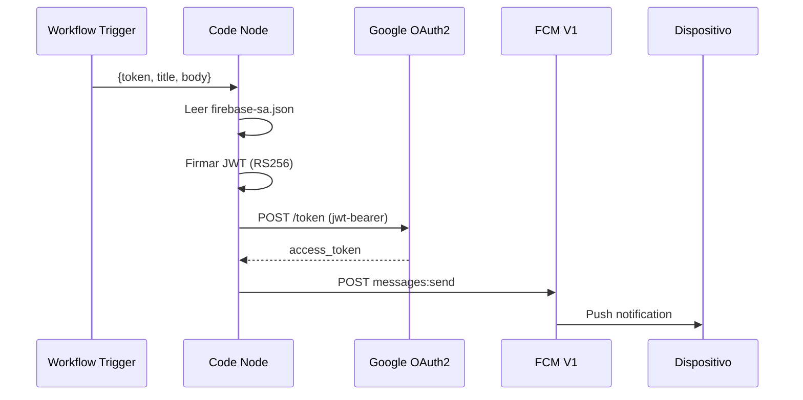

# Feature #1: Firebase (FCM + Auth)

> **Issue:** [#1](https://github.com/monghithub/familitrack/issues/1) - Configurar Firebase (FCM + Auth)
> **Estado:** Completada

## Descripción

Configuración de Firebase Cloud Messaging (FCM) con la API V1 para enviar notificaciones push entre miembros de la familia. Incluye la integración en la app Android y la configuración del Service Account en el servidor para autenticación server-side.

## Componentes

### App Android

| Archivo | Función |
|---------|---------|
| `app/google-services.json` | Configuración Firebase (no versionado) |
| `FamilyTrackApp.kt` | Creación de canales de notificación |
| `FamilyTrackMessagingService.kt` | Receiver de mensajes FCM |
| `BootReceiver.kt` | Re-registro FCM al reiniciar |

### Backend (n8n)

| Workflow | Función |
|----------|---------|
| Send Push (`0T5QZkWzblHs6z3N`) | Genera JWT, obtiene access_token OAuth2, envía FCM V1 |

### Infraestructura

| Recurso | Ubicación |
|---------|-----------|
| Service Account JSON | `/opt/n8n/local-files/firebase-sa.json` (montado en `/files/`) |
| Firebase Project | `family-track-5548b` |
| Sender ID | `411545008321` |

## Flujo de Push Notification



## Canales de Notificación

| Canal | ID | Prioridad | Uso |
|-------|-----|-----------|-----|
| Alertas familiares | `family_alerts` | Alta | Alertas de zona, offline, manual |
| Servicio de ubicación | `location_service` | Baja | Notificación persistente del servicio |

## Tipos de Alerta

| Tipo | Trigger | Mensaje ejemplo |
|------|---------|-----------------|
| `zone_exit` | Salida de zona segura | "Hijo ha salido de Casa" |
| `zone_entry` | Entrada a zona segura | "Hijo ha llegado a Colegio" |
| `offline` | 24h sin reportar | "Hijo no ha reportado ubicación" |
| `manual` | Botón en FamilyScreen | "Padre te ha enviado una alerta" |

## Configuración Requerida

1. Crear proyecto en Firebase Console
2. Registrar app Android (package + SHA-1)
3. Descargar `google-services.json` con clients para ambos packages (release + debug)
4. Habilitar FCM V1 API
5. Crear Service Account con permisos FCM
6. Montar SA JSON en el container n8n

## Variable de Entorno Crítica

```bash
NODE_FUNCTION_ALLOW_BUILTIN=crypto,fs
```

Necesaria para que el Code node de n8n pueda generar JWTs usando `crypto` y leer el Service Account con `fs`.
