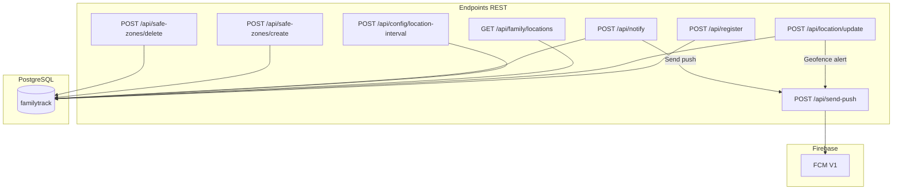
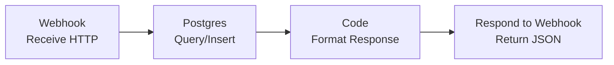

# Feature #2: Backend con n8n (Workflows)

> **Issue:** [#2](https://github.com/monghithub/familitrack/issues/2) - Crear workflows en n8n (Backend)
> **Estado:** Completada

## Descripción

El backend de FamilyTrack está implementado como workflows de n8n, cada uno exponiendo un endpoint webhook. n8n actúa como orquestador serverless que conecta los webhooks HTTP con PostgreSQL y Firebase FCM.

## Workflows Activos

| ID | Nombre | Endpoint | Método |
|----|--------|----------|--------|
| `szQNpD8E8JA0NUq0` | Register Device | `/api/register` | POST |
| `7AoJKxLu5XJUZmk6` | Location Update | `/api/location/update` | POST |
| `lA6F0YjeZOO8wcBf` | Family Locations | `/api/family/locations` | GET |
| `lio5OnRuAAeyJcYe` | Config Interval | `/api/config/location-interval` | POST |
| `Ra2UKsJkuqo3eLsk` | Manual Notify | `/api/notify` | POST |
| `0T5QZkWzblHs6z3N` | Send Push | `/api/send-push` | POST |
| `cb88e37a2b564080842a` | Create Safe Zone | `/api/safe-zones/create` | POST |
| `e9a230a94d974e57b435` | Delete Safe Zone | `/api/safe-zones/delete` | POST |
| `W5xxwjdZMuPeT6xX` | Health Check | CRON 24h | - |

## Arquitectura de Workflows



## URL de Producción

```
https://server.monghit.com/webhook/
```

Configurado en `app/build.gradle.kts`:

```kotlin
buildConfigField("String", "BASE_URL", "\"https://server.monghit.com/webhook/\"")
```

## Estructura de un Workflow Típico



## Credencial PostgreSQL

| Campo | Valor |
|-------|-------|
| ID en n8n | `tUhgoGHD50ho6lDG` |
| Host | `familytrack-db` |
| Port | 5432 |
| Database | `familytrack` |
| User | `familytrack` |

## Gestión de Workflows

### Importar workflow

```bash
docker cp workflow.json n8n:/tmp/
docker exec n8n n8n import:workflow --input=/tmp/workflow.json
```

### Activar/Publicar

```bash
docker exec n8n n8n publish:workflow --id=WORKFLOW_ID
docker restart n8n
```

### Listar activos

```bash
docker exec n8n n8n list:workflow --active=true
```

> **Nota:** La importación CLI puede fallar por locks de SQLite. En ese caso, usar scripts Python con acceso directo al volumen. Ver [setup-guide.md](../setup-guide.md#9-gestión-de-workflows-n8n-cli).

## Archivos de Workflow (Versionados)

Los JSONs de workflows están en `infra/n8n-workflows/`:

```
infra/n8n-workflows/
├── 07-family-locations-v2.json
├── 08-create-safe-zone.json
└── 09-delete-safe-zone.json
```
