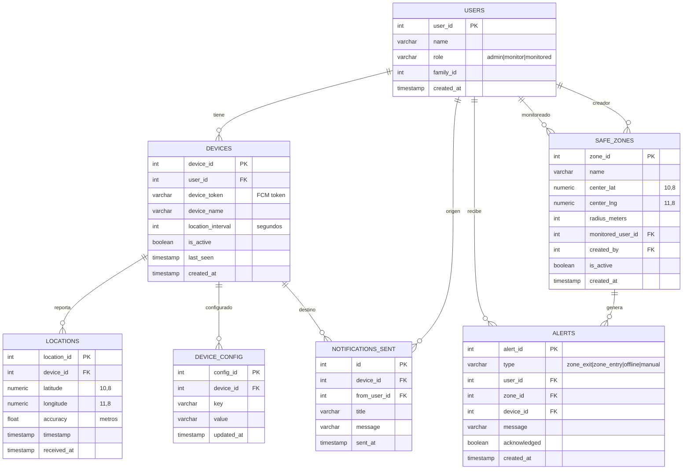

# Feature #3: PostgreSQL (Esquema de Base de Datos)

> **Issue:** [#3](https://github.com/monghithub/familitrack/issues/3) - Configurar PostgreSQL
> **Estado:** Completada

## Descripción

Base de datos PostgreSQL 16 desplegada en Docker como container `familytrack-db` en la red `traefik-net`. Almacena usuarios, dispositivos, ubicaciones, zonas seguras, alertas y notificaciones.

## Diagrama Entidad-Relación



## Tablas

### `users`

| Columna | Tipo | Descripción |
|---------|------|-------------|
| user_id | SERIAL PK | ID único |
| name | VARCHAR(100) | Nombre del miembro |
| role | VARCHAR(20) | `admin`, `monitor`, `monitored` |
| family_id | INT | Grupo familiar |
| created_at | TIMESTAMP | Fecha de creación |

### `devices`

| Columna | Tipo | Descripción |
|---------|------|-------------|
| device_id | SERIAL PK | ID único |
| user_id | INT FK | Usuario propietario |
| device_token | VARCHAR(500) | Token FCM |
| device_name | VARCHAR(100) | Nombre del dispositivo |
| location_interval | INT | Intervalo en segundos (default 300) |
| is_active | BOOLEAN | Activo o no |
| last_seen | TIMESTAMP | Último reporte |
| created_at | TIMESTAMP | Fecha de registro |

### `locations`

| Columna | Tipo | Descripción |
|---------|------|-------------|
| location_id | SERIAL PK | ID único |
| device_id | INT FK | Dispositivo que reportó |
| latitude | NUMERIC(10,8) | Latitud |
| longitude | NUMERIC(11,8) | Longitud |
| accuracy | FLOAT | Precisión en metros |
| timestamp | TIMESTAMP | Momento de la lectura GPS |
| received_at | TIMESTAMP | Momento de recepción en servidor |

### `safe_zones`

| Columna | Tipo | Descripción |
|---------|------|-------------|
| zone_id | SERIAL PK | ID único |
| name | VARCHAR(100) | Nombre de la zona |
| center_lat | NUMERIC(10,8) | Latitud del centro |
| center_lng | NUMERIC(11,8) | Longitud del centro |
| radius_meters | INT | Radio del geofence |
| monitored_user_id | INT FK | Usuario monitoreado |
| created_by | INT FK | Usuario que creó la zona |
| is_active | BOOLEAN | Activa (soft-delete) |
| created_at | TIMESTAMP | Fecha de creación |

### Índices

```sql
idx_safe_zones_active    ON safe_zones(is_active) WHERE is_active = true
idx_safe_zones_user      ON safe_zones(monitored_user_id)
```

## Datos Seed

5 usuarios de ejemplo y 2 zonas seguras:

```sql
-- Usuarios
INSERT INTO users (name, role, family_id) VALUES
    ('Admin', 'admin', 1),
    ('Madre', 'monitor', 1),
    ('Padre', 'monitor', 1),
    ('Hijo', 'monitored', 1),
    ('Abuela', 'monitored', 1);

-- Zonas seguras
INSERT INTO safe_zones (name, center_lat, center_lng, radius_meters, monitored_user_id, created_by) VALUES
    ('Casa', 40.4168, -3.7038, 200, 4, 1),
    ('Colegio', 40.42, -3.701, 150, 4, 1);
```

## Infraestructura

```yaml
# /opt/apps/pro/familytrack/docker-compose.yml
services:
  familytrack-db:
    image: postgres:16
    container_name: familytrack-db
    restart: unless-stopped
    environment:
      POSTGRES_DB: familytrack
      POSTGRES_USER: familytrack
      POSTGRES_PASSWORD: ${POSTGRES_PASSWORD}
    volumes:
      - familytrack_data:/var/lib/postgresql/data
      - ./init:/docker-entrypoint-initdb.d
    networks:
      - traefik-net
```

## Queries Útiles

```sql
-- Ubicaciones recientes
SELECT u.name, l.latitude, l.longitude, l.created_at
FROM locations l
JOIN devices d ON l.device_id = d.id
JOIN users u ON d.user_id = u.id
ORDER BY l.created_at DESC LIMIT 10;

-- Dispositivos offline (>24h)
SELECT u.name, d.device_name, d.last_seen
FROM devices d JOIN users u ON d.user_id = u.user_id
WHERE d.is_active = true
AND d.last_seen < NOW() - INTERVAL '24 hours';

-- Zonas seguras activas
SELECT * FROM safe_zones WHERE is_active = true;
```
