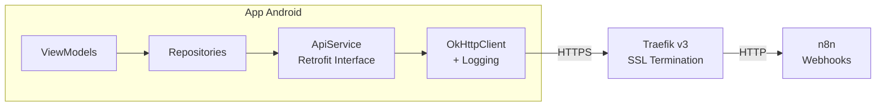
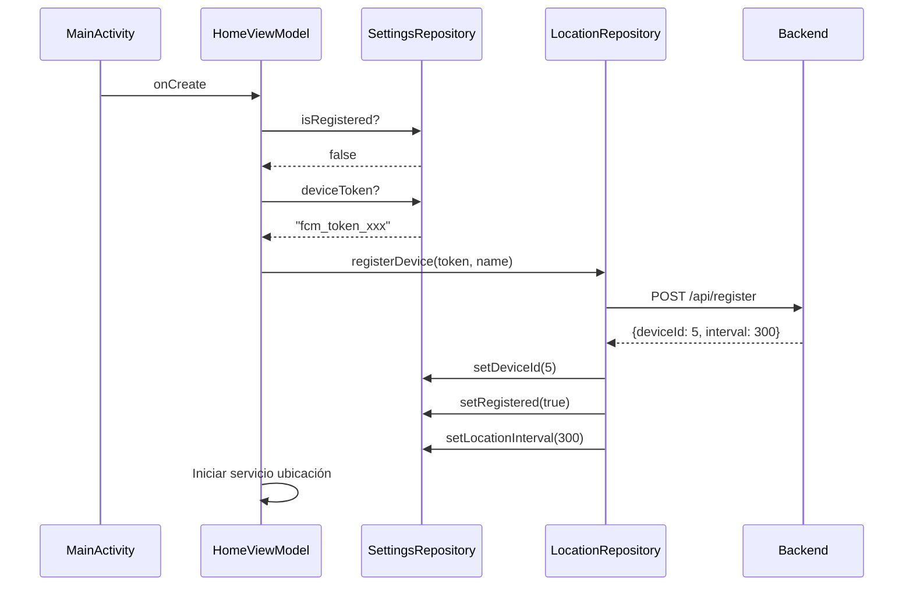

# Feature #4: Conexión App Android con Backend

> **Issue:** [#4](https://github.com/monghithub/familitrack/issues/4) - Conectar app Android con backend
> **Estado:** Completada

## Descripción

Integración de la app Android con el backend n8n mediante Retrofit. Incluye la configuración de red, DTOs de request/response, el servicio API y los repositorios de datos.

## Arquitectura de Red



## Componentes

### ApiService (`data/remote/ApiService.kt`)

Interface Retrofit con todos los endpoints:

```kotlin
interface ApiService {
    @POST("api/register")
    suspend fun registerDevice(@Body request: RegisterDeviceRequest): Response<RegisterDeviceResponse>

    @POST("api/location/update")
    suspend fun updateLocation(@Body request: LocationUpdateRequest): Response<Unit>

    @GET("api/family/locations")
    suspend fun getFamilyLocations(): Response<FamilyLocationsResponse>

    @POST("api/config/location-interval")
    suspend fun updateLocationInterval(
        @Query("deviceToken") deviceToken: String,
        @Query("intervalSeconds") intervalSeconds: Int
    ): Response<ConfigUpdateResponse>

    @POST("api/notify")
    suspend fun sendManualNotification(@Body request: ManualNotifyRequest): Response<Unit>

    @POST("api/safe-zones/create")
    suspend fun createSafeZone(@Body request: CreateSafeZoneRequest): Response<CreateSafeZoneResponse>

    @POST("api/safe-zones/delete")
    suspend fun deleteSafeZone(@Body request: DeleteSafeZoneRequest): Response<DeleteSafeZoneResponse>
}
```

### DTOs (`data/remote/dto/ApiDtos.kt`)

| DTO | Dirección | Endpoint |
|-----|-----------|----------|
| `RegisterDeviceRequest` | Request | `/api/register` |
| `RegisterDeviceResponse` | Response | `/api/register` |
| `LocationUpdateRequest` | Request | `/api/location/update` |
| `FamilyLocationsResponse` | Response | `/api/family/locations` |
| `FamilyMemberDto` | Nested | En FamilyLocationsResponse |
| `SafeZoneDto` | Nested | En FamilyLocationsResponse |
| `LocationDto` | Nested | En FamilyMemberDto |
| `ManualNotifyRequest` | Request | `/api/notify` |
| `ConfigUpdateRequest` | Request | `/api/config/location-interval` |
| `CreateSafeZoneRequest` | Request | `/api/safe-zones/create` |
| `CreateSafeZoneResponse` | Response | `/api/safe-zones/create` |
| `DeleteSafeZoneRequest` | Request | `/api/safe-zones/delete` |
| `DeleteSafeZoneResponse` | Response | `/api/safe-zones/delete` |

### Repositories

| Repository | Responsabilidad |
|------------|----------------|
| `LocationRepository` | Registro, ubicaciones, zonas seguras, notificaciones |
| `SettingsRepository` | Preferencias locales (DataStore) |

### Inyección de Dependencias (`di/AppModule.kt`)

```kotlin
@Module
@InstallIn(SingletonComponent::class)
object AppModule {
    @Provides @Singleton
    fun provideRetrofit(): Retrofit = Retrofit.Builder()
        .baseUrl(BuildConfig.BASE_URL)
        .addConverterFactory(GsonConverterFactory.create())
        .client(OkHttpClient.Builder()
            .addInterceptor(HttpLoggingInterceptor())
            .build())
        .build()

    @Provides @Singleton
    fun provideApiService(retrofit: Retrofit): ApiService =
        retrofit.create(ApiService::class.java)
}
```

## Flujo de Auto-Registro


