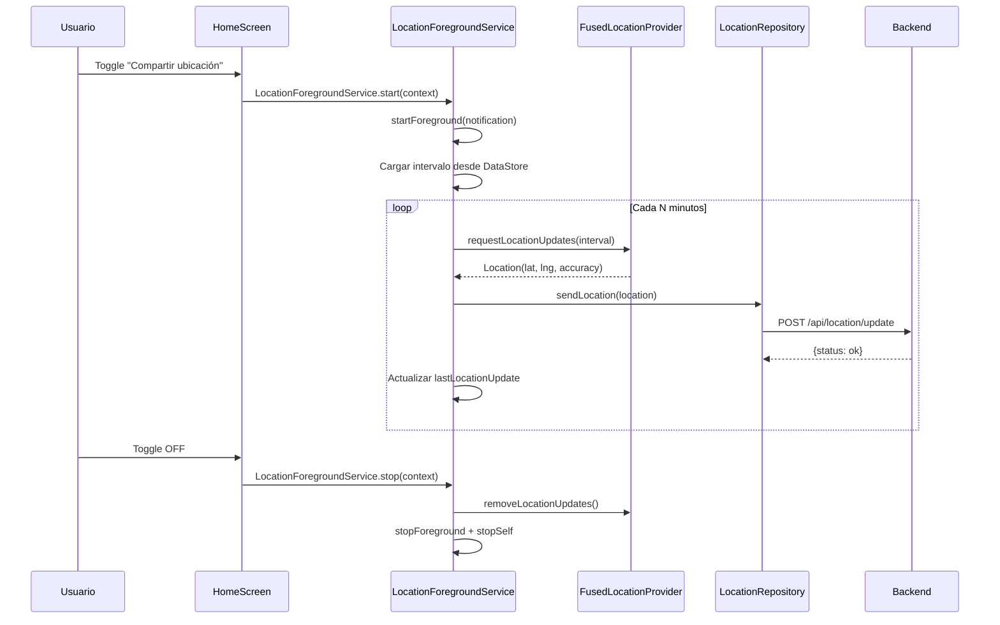

# Feature #5: Servicio de Ubicación en Primer Plano

> **Issue:** [#5](https://github.com/monghithub/familitrack/issues/5) - Activar servicio de ubicación en primer plano
> **Estado:** Completada

## Descripción

Servicio Android `ForegroundService` de tipo `location` que obtiene la ubicación GPS del dispositivo periódicamente y la envía al backend. Se ejecuta en segundo plano con una notificación persistente.

## Componentes

| Archivo | Función |
|---------|---------|
| `LocationForegroundService.kt` | Servicio principal de ubicación |
| `BootReceiver.kt` | Re-inicia el servicio al reiniciar el dispositivo |
| `SettingsRepository.kt` | Persistencia del intervalo y estado |

## Flujo del Servicio



## Características

### Notificación Persistente

```
Canal: location_service
Título: "FamilyTrack activo"
Texto: "Compartiendo tu ubicación con la familia"
Prioridad: LOW (no hace sonido)
```

### Intervalo Configurable

- **Rango:** 1-60 minutos
- **Default:** 5 minutos (300 segundos)
- **Configuración:** Slider en SettingsScreen
- **Propagación:** Al cambiar, se envía `ACTION_UPDATE_INTERVAL` al servicio activo

### Acciones del Companion Object

```kotlin
companion object {
    fun start(context: Context)                    // Inicia el servicio
    fun stop(context: Context)                     // Detiene el servicio
    fun updateInterval(context: Context, seconds: Int)  // Cambia intervalo en caliente
}
```

## Permisos Requeridos

```xml
<uses-permission android:name="android.permission.ACCESS_FINE_LOCATION" />
<uses-permission android:name="android.permission.ACCESS_COARSE_LOCATION" />
<uses-permission android:name="android.permission.ACCESS_BACKGROUND_LOCATION" />
<uses-permission android:name="android.permission.FOREGROUND_SERVICE" />
<uses-permission android:name="android.permission.FOREGROUND_SERVICE_LOCATION" />
<uses-permission android:name="android.permission.POST_NOTIFICATIONS" />
<uses-permission android:name="android.permission.RECEIVE_BOOT_COMPLETED" />
```

## Manifest

```xml
<service
    android:name=".services.LocationForegroundService"
    android:foregroundServiceType="location"
    android:exported="false" />

<receiver
    android:name=".services.BootReceiver"
    android:exported="true">
    <intent-filter>
        <action android:name="android.intent.action.BOOT_COMPLETED" />
    </intent-filter>
</receiver>
```

## Correcciones Implementadas (Issue #5)

1. **Race condition**: `LocationRequest` se construía antes de cargar el intervalo desde DataStore. Movido dentro de la coroutine.
2. **DeviceId hardcoded**: Se leía `0` en lugar del deviceId real desde `SettingsRepository`.
3. **Intervalo en caliente**: Añadido `ACTION_UPDATE_INTERVAL` para cambiar el intervalo sin reiniciar el servicio.
