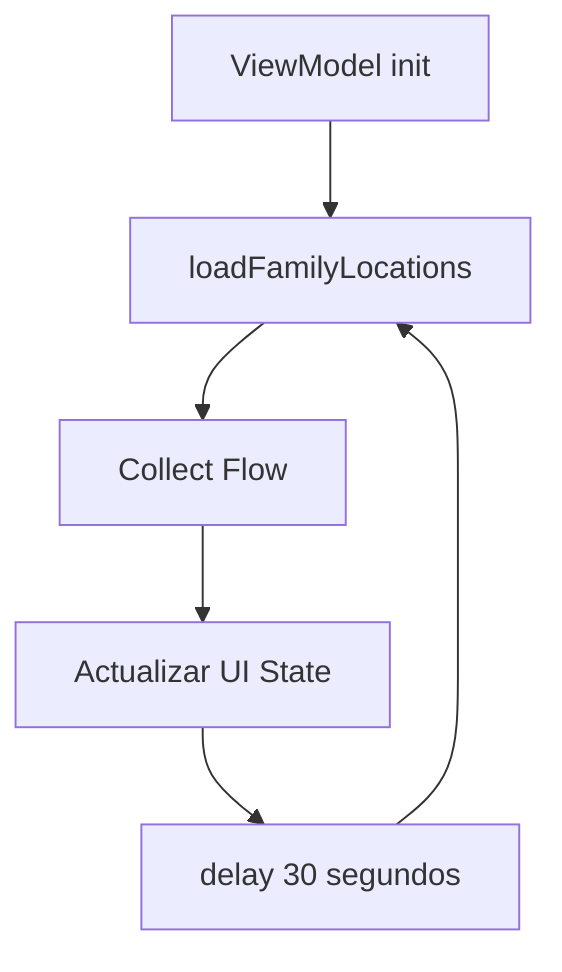

# Feature #6: Pantalla de Mapa con Ubicaciones Familiares

> **Issue:** [#6](https://github.com/monghithub/familitrack/issues/6) - Pantalla de mapa con ubicaciones familiares
> **Estado:** Completada

## Descripción

Pantalla con Google Maps que muestra las ubicaciones en tiempo real de todos los miembros de la familia, junto con las zonas seguras dibujadas como círculos. Incluye auto-refresh cada 30 segundos.

## Componentes

| Archivo | Función |
|---------|---------|
| `MapScreen.kt` | UI con GoogleMap, marcadores y círculos |
| `MapViewModel.kt` | Estado, carga de datos y auto-refresh |
| `FamilyLocationMarker` | Data class para marcadores |

## Captura Conceptual

```
┌─────────────────────────────────┐
│  [🛡 Zonas Seguras]       (FAB) │
│                                 │
│    ┌─── Casa (200m) ───┐       │
│    │   ○ Madre          │       │
│    │       ○ Admin      │       │
│    └────────────────────┘       │
│                                 │
│    ┌─ Colegio (150m) ─┐        │
│    │   ○ Hijo          │        │
│    └───────────────────┘        │
│                                 │
│  ○ Abuela                      │
│                                 │
├─────────────────────────────────┤
│ 🏠 Inicio │ 🗺 Mapa │ 👥 │ ⚙️ │
└─────────────────────────────────┘
```

## Elementos del Mapa

### Marcadores (Miembros)

Cada miembro de la familia aparece como un marcador con:
- **Título**: Nombre del miembro
- **Snippet**: Última vez visto formateado

### Círculos (Zonas Seguras)

Cada zona segura se dibuja como un `Circle`:
- **Stroke**: Azul `#1976D2`, 2px
- **Fill**: Azul con 12% opacidad `#201976D2`
- **Centro**: `LatLng(centerLat, centerLng)`
- **Radio**: `radiusMeters` en metros

### FAB de Zonas Seguras

Botón flotante con icono `Shield` en la esquina superior derecha que navega a `SafeZonesScreen`.

## Auto-Refresh



El `MapViewModel` recarga las ubicaciones cada 30 segundos automáticamente mientras la pantalla está activa.

## MapUiState

```kotlin
data class MapUiState(
    val isLoading: Boolean = true,
    val familyLocations: List<FamilyLocationMarker> = emptyList(),
    val safeZones: List<SafeZone> = emptyList(),
    val currentUserLocation: LatLng? = null,
    val error: String? = null
)
```

## Dependencias

```toml
google-maps-compose = "6.1.0"
play-services-maps = "19.0.0"
```

## Configuración de API Key

La API key de Google Maps se lee de `local.properties` y se inyecta via `manifestPlaceholders`:

```kotlin
// build.gradle.kts
manifestPlaceholders["MAPS_API_KEY"] = localProperties["MAPS_API_KEY"] ?: ""
```

```xml
<!-- AndroidManifest.xml -->
<meta-data
    android:name="com.google.android.geo.API_KEY"
    android:value="${MAPS_API_KEY}" />
```
