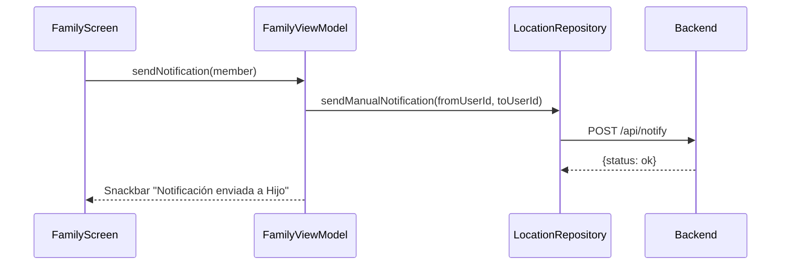

# Feature #7: Pantalla de Familia con Datos Reales

> **Issue:** [#7](https://github.com/monghithub/familitrack/issues/7) - Pantalla de familia con datos reales
> **Estado:** Completada

## Descripción

Pantalla que muestra la lista de miembros de la familia con su estado en tiempo real (online/offline), rol, última ubicación y posibilidad de enviar notificaciones manuales. Incluye pull-to-refresh.

## Componentes

| Archivo | Función |
|---------|---------|
| `FamilyScreen.kt` | UI con lista de miembros y acciones |
| `FamilyViewModel.kt` | Estado, refresh y notificaciones |

## Captura Conceptual

```
┌─────────────────────────────────┐
│  Mi Familia               ↻     │
│                                 │
│  ┌─────────────────────────┐   │
│  │ 📍 Admin          🔔   │   │
│  │ Admin · En línea        │   │
│  │ Visto: 07/02 23:15      │   │
│  └─────────────────────────┘   │
│                                 │
│  ┌─────────────────────────┐   │
│  │ 📍 Madre           🔔   │   │
│  │ Monitor · En línea      │   │
│  │ Visto: 07/02 23:10      │   │
│  └─────────────────────────┘   │
│                                 │
│  ┌─────────────────────────┐   │
│  │ 📍 Hijo            🔔   │   │
│  │ Monitoreado · Sin conexión│  │
│  │ Visto: 07/02 18:30      │   │
│  └─────────────────────────┘   │
│                                 │
├─────────────────────────────────┤
│ 🏠 │ 🗺 │ 👥 Familia │ ⚙️    │
└─────────────────────────────────┘
```

## Características

### Tarjetas de Miembros

Cada tarjeta muestra:
- **Icono de ubicación**: Color según disponibilidad (verde online, gris offline)
- **Nombre**: Del miembro
- **Badge de rol**: `Admin` / `Monitor` / `Monitoreado` con colores distintivos
- **Estado**: "En línea" o "Sin conexión"
- **Última vez visto**: Formato "Visto: DD/MM HH:mm"
- **Botón notificación**: Campana para enviar alerta manual

### Pull-to-Refresh

Implementado con `PullToRefreshBox` (requiere Compose BOM 2024.12.01+):

```kotlin
PullToRefreshBox(
    isRefreshing = uiState.isRefreshing,
    onRefresh = viewModel::refresh
) {
    LazyColumn { /* ... */ }
}
```

### Estados de UI

| Estado | Visualización |
|--------|--------------|
| Loading | `CircularProgressIndicator` centrado |
| Error | Mensaje de error + botón reintentar |
| Empty | Mensaje "No hay miembros registrados" |
| Data | Lista de tarjetas de miembros |

### Notificación Manual



## FamilyUiState

```kotlin
data class FamilyUiState(
    val members: List<FamilyMember> = emptyList(),
    val isLoading: Boolean = true,
    val isRefreshing: Boolean = false,
    val error: String? = null,
    val notifyMessage: String? = null
)
```

## Colores de Rol

| Rol | Color | Badge |
|-----|-------|-------|
| Admin | `primaryContainer` | "Admin" |
| Monitor | `secondaryContainer` | "Monitor" |
| Monitoreado | `tertiaryContainer` | "Monitoreado" |

## Upgrade de Compose BOM

Para usar `PullToRefreshBox` fue necesario actualizar el Compose BOM:

```diff
- composeBom = "2024.08.00"
+ composeBom = "2024.12.01"
```
