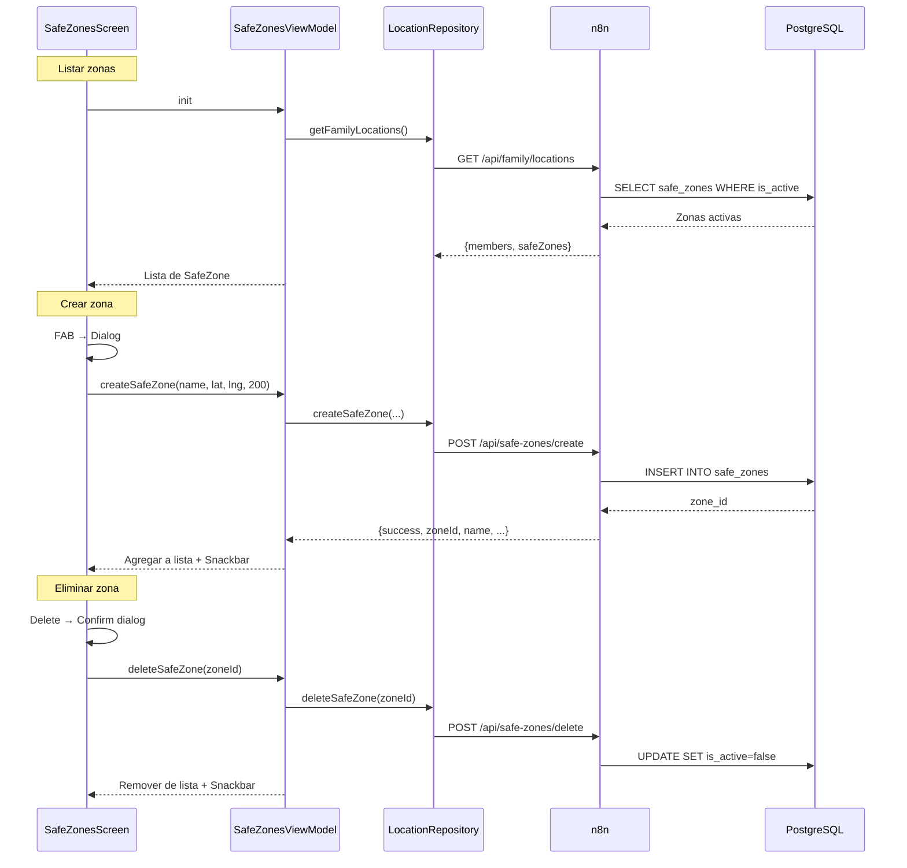
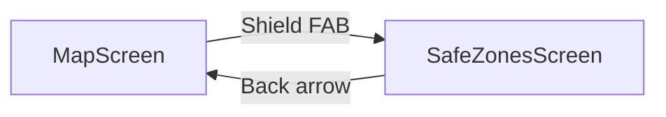

# Feature #8: Gestión de Zonas Seguras (Geofencing)

> **Issue:** [#8](https://github.com/monghithub/familitrack/issues/8) - Gestión de zonas seguras (geofencing)
> **Estado:** Completada

## Descripción

Sistema completo de gestión de zonas seguras (geofences) que permite crear y eliminar zonas con nombre, coordenadas y radio. Las zonas se visualizan en el mapa como círculos y se almacenan en PostgreSQL. El backend valida las ubicaciones contra las zonas activas.

## Componentes

### App Android

| Archivo | Función |
|---------|---------|
| `SafeZonesScreen.kt` | UI con lista, creación y eliminación |
| `SafeZonesViewModel.kt` | Estado y acciones CRUD |
| `ApiDtos.kt` | `CreateSafeZoneRequest/Response`, `DeleteSafeZoneRequest/Response` |
| `ApiService.kt` | Endpoints `createSafeZone()`, `deleteSafeZone()` |
| `LocationRepository.kt` | Métodos `createSafeZone()`, `deleteSafeZone()` |
| `MapScreen.kt` | Renderizado de círculos en mapa |

### Backend (n8n)

| Workflow | ID | Endpoint |
|----------|-----|----------|
| Create Safe Zone | `cb88e37a2b564080842a` | `POST /api/safe-zones/create` |
| Delete Safe Zone | `e9a230a94d974e57b435` | `POST /api/safe-zones/delete` |

## Flujo CRUD



## Pantalla SafeZonesScreen

### Elementos

| Elemento | Descripción |
|----------|-------------|
| TopAppBar | Título "Zonas Seguras" + botón back |
| LazyColumn | Lista de tarjetas de zonas |
| SafeZoneCard | Nombre, coordenadas, radio, botón eliminar |
| FAB | Botón "+" para crear nueva zona |
| CreateSafeZoneDialog | Formulario con nombre, lat, lng, slider radio |
| AlertDialog confirmación | Confirmación antes de eliminar |

### Create Dialog

| Campo | Tipo | Rango |
|-------|------|-------|
| Nombre | TextField | Texto libre |
| Latitud | TextField | Numérico (double) |
| Longitud | TextField | Numérico (double) |
| Radio | Slider | 50-1000 metros (steps: 50) |

## Visualización en Mapa

Las zonas seguras se dibujan en `MapScreen` como `Circle` de Google Maps Compose:

```kotlin
safeZones.forEach { zone ->
    Circle(
        center = LatLng(zone.centerLat, zone.centerLng),
        radius = zone.radiusMeters.toDouble(),
        strokeColor = Color(0xFF1976D2),
        strokeWidth = 2f,
        fillColor = Color(0x201976D2)
    )
}
```

## API Request/Response

### Crear zona

```json
// POST /api/safe-zones/create
// Request
{
    "name": "Parque",
    "lat": 40.419,
    "lng": -3.706,
    "radiusMeters": 150,
    "monitoredUserId": 4,
    "createdBy": 1
}

// Response (201)
{
    "success": true,
    "zoneId": 3,
    "name": "Parque",
    "lat": 40.419,
    "lng": -3.706,
    "radiusMeters": 150
}
```

### Eliminar zona (soft-delete)

```json
// POST /api/safe-zones/delete
// Request
{ "zoneId": 3 }

// Response (200)
{ "success": true, "zoneId": 3, "name": "Parque" }
```

## Navegación

Acceso desde `MapScreen` via FAB con icono `Shield`:



Ruta definida en `NavRoutes.SafeZones` (`"safe_zones"`).
