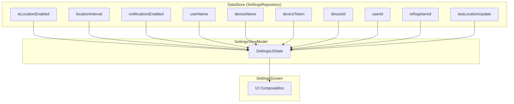

# Feature #9: Pantalla de Configuración con Ajustes Reales

> **Issue:** [#9](https://github.com/monghithub/familitrack/issues/9) - Pantalla de configuración con ajustes reales
> **Estado:** Completada

## Descripción

Pantalla de ajustes completa con configuración de ubicación (toggle y slider de intervalo), notificaciones, información del dispositivo, acciones de prueba y logout.

## Componentes

| Archivo | Función |
|---------|---------|
| `SettingsScreen.kt` | UI con secciones de configuración |
| `SettingsViewModel.kt` | Estado y acciones |

## Secciones de la Pantalla

```
┌──────────────────────────────────┐
│ Ajustes                          │
│                                  │
│ 📍 Ubicación                     │
│ ┌──────────────────────────────┐ │
│ │ Compartir ubicación    [ON]  │ │
│ │ Intervalo de actualización   │ │
│ │ ██████████░░░░░░  5 min      │ │
│ └──────────────────────────────┘ │
│                                  │
│ 🔔 Notificaciones               │
│ ┌──────────────────────────────┐ │
│ │ Recibir alertas        [ON]  │ │
│ └──────────────────────────────┘ │
│                                  │
│ 👤 Cuenta                        │
│ ┌──────────────────────────────┐ │
│ │ Tu nombre      Usuario 1    │ │
│ │ Nombre dispositivo  Xiaomi  │ │
│ └──────────────────────────────┘ │
│                                  │
│ 📱 Dispositivo                   │
│ ┌──────────────────────────────┐ │
│ │ ID dispositivo: 5            │ │
│ │ ID usuario: 1                │ │
│ │ Registrado: Sí               │ │
│ │ Última ubicación: 07/02 23:15│ │
│ │ Token FCM                    │ │
│ │ dG9rZW4xMjM0NTY3...0NTY3    │ │
│ └──────────────────────────────┘ │
│                                  │
│ 🔧 Acciones                     │
│ ┌──────────────────────────────┐ │
│ │ [📍 Enviar ubicación] [🔔 Probar]│
│ └──────────────────────────────┘ │
│                                  │
│ ℹ️ Acerca de                     │
│ ┌──────────────────────────────┐ │
│ │ Versión 1.0                  │ │
│ └──────────────────────────────┘ │
│                                  │
│      🚪 Cerrar sesión            │
└──────────────────────────────────┘
```

## Flujo de Datos



## Acciones del ViewModel

| Acción | Efecto |
|--------|--------|
| `toggleLocationEnabled(bool)` | Activa/desactiva servicio + DataStore |
| `updateInterval(minutes)` | Actualiza DataStore + backend + servicio activo |
| `toggleNotifications(bool)` | Actualiza DataStore |
| `sendTestNotification()` | Envía push a sí mismo via `/api/notify` |
| `forceLocationSend()` | Reinicia servicio para forzar envío |
| `logout()` | Para servicio + limpia DataStore |

## Slider de Intervalo

```kotlin
Slider(
    value = sliderValue,
    onValueChange = { sliderValue = it },
    onValueChangeFinished = { onIntervalChange(sliderValue.toInt()) },
    valueRange = 1f..60f,
    steps = 58
)
```

- **Rango:** 1-60 minutos
- **Steps:** 58 (1 por cada minuto intermedio)
- **Propagación:** Al soltar el slider → DataStore → Backend → Servicio activo

## SettingsUiState

```kotlin
data class SettingsUiState(
    val isLocationEnabled: Boolean = false,
    val intervalMinutes: Int = 5,
    val notificationsEnabled: Boolean = true,
    val userName: String = "",
    val deviceName: String = "",
    val deviceToken: String = "",
    val deviceId: Int = 0,
    val userId: Int = 0,
    val isRegistered: Boolean = false,
    val lastLocationUpdate: String = "Nunca",
    val actionMessage: String? = null
)
```
