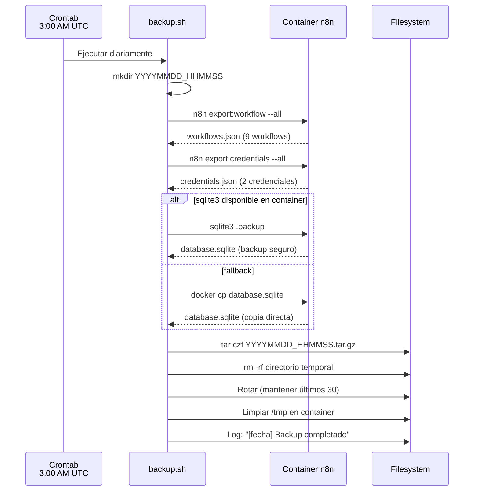

# Feature #10: Backup Automático de n8n

> **Issue:** [#10](https://github.com/monghithub/familitrack/issues/10) - Backup automático de n8n (cron)
> **Estado:** Completada

## Descripción

Sistema de backup automático diario para n8n que exporta workflows, credenciales y la base de datos SQLite. Ejecutado via cron job a las 3:00 AM UTC con rotación de los últimos 30 backups.

## Componentes

| Archivo | Ubicación | Función |
|---------|-----------|---------|
| `infra/n8n-backup/backup.sh` | Repo (versionado) | Script de backup |
| `infra/n8n-backup/setup-cron.sh` | Repo (versionado) | Script de instalación del cron |
| `/opt/apps/pro/n8n-backups/backup.sh` | Servidor IONOS | Script activo |
| `/var/log/n8n-backup.log` | Servidor IONOS | Log de ejecuciones |

## Flujo del Backup



## Contenido del Backup

Cada archivo `.tar.gz` contiene:

```
YYYYMMDD_HHMMSS/
├── workflows.json      # Todos los workflows exportados
├── credentials.json    # Credenciales (encriptadas)
└── database.sqlite     # Base de datos completa de n8n
```

## Tamaño Típico

| Archivo | Tamaño aprox. |
|---------|---------------|
| workflows.json | ~50 KB |
| credentials.json | ~5 KB |
| database.sqlite | ~400 KB |
| **tar.gz comprimido** | **~140 KB** |

## Configuración del Cron

```bash
# crontab -l
0 3 * * * /opt/apps/pro/n8n-backups/backup.sh >> /var/log/n8n-backup.log 2>&1
```

- **Frecuencia:** Diaria a las 3:00 AM UTC (4:00 AM hora Madrid en invierno)
- **Retención:** 30 días (configurable via `MAX_BACKUPS`)
- **Log:** `/var/log/n8n-backup.log`

## Restauración

### Restaurar workflows

```bash
# Extraer backup
tar xzf YYYYMMDD_HHMMSS.tar.gz

# Importar workflows
docker cp YYYYMMDD_HHMMSS/workflows.json n8n:/tmp/
docker exec n8n n8n import:workflow --input=/tmp/workflows.json
```

### Restaurar credenciales

```bash
docker cp YYYYMMDD_HHMMSS/credentials.json n8n:/tmp/
docker exec n8n n8n import:credentials --input=/tmp/credentials.json
```

### Restaurar base de datos completa

```bash
# ⚠️ DETENER n8n primero
docker stop n8n

# Reemplazar base de datos
docker cp YYYYMMDD_HHMMSS/database.sqlite n8n:/home/node/.n8n/database.sqlite

# Reiniciar
docker start n8n
```

## Verificación

```bash
# Verificar cron activo
crontab -l

# Verificar último backup
ls -lh /opt/apps/pro/n8n-backups/*.tar.gz | tail -5

# Verificar contenido
tar tzf /opt/apps/pro/n8n-backups/ULTIMO.tar.gz

# Verificar logs
tail -5 /var/log/n8n-backup.log
```

## Instalación en Nuevo Servidor

```bash
cd infra/n8n-backup/
chmod +x setup-cron.sh backup.sh
./setup-cron.sh
```
