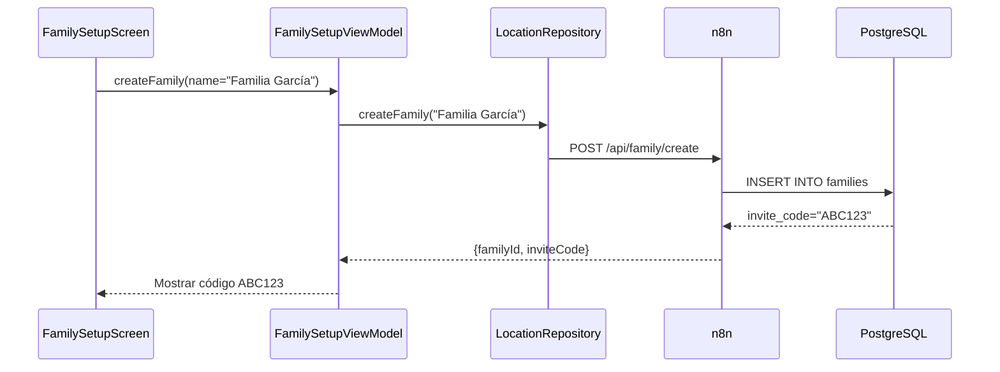

# Feature #11: Registro de Familia

> **Issue:** [#22](https://github.com/monghithub/familitrack/issues/22) - Crear/unirme a familia
> **Estado:** Completada

## Descripción

Wizard interactivo de configuración inicial que permite al usuario crear una nueva familia o unirse a una familia existente mediante código de invitación. Genera automáticamente un código único de 6 caracteres para compartir con otros miembros.

## Componentes

| Archivo | Función |
|---------|---------|
| `FamilySetupScreen.kt` | UI wizard con 2 opciones (crear/unirme) |
| `FamilySetupViewModel.kt` | Estado, validaciones y creación de familia |
| `ApiDtos.kt` | `CreateFamilyRequest/Response`, `JoinFamilyRequest/Response` |
| `ApiService.kt` | Endpoints `createFamily()`, `joinFamily()` |
| `LocationRepository.kt` | Métodos `createFamily()`, `joinFamily()` |

## Captura Conceptual

```
┌─────────────────────────────────┐
│  Bienvenido a FamilyTrack        │
│                                 │
│  ¿Qué deseas hacer?             │
│                                 │
│  ┌──────────────────────┐       │
│  │ ➕ Crear Familia     │       │
│  │ Sé el primer admin   │       │
│  └──────────────────────┘       │
│                                 │
│  ┌──────────────────────┐       │
│  │ 🔗 Unirme a Familia  │       │
│  │ Pide código a otros  │       │
│  └──────────────────────┘       │
└─────────────────────────────────┘
```

## Características

### Opción 1: Crear Familia

1. **Input del nombre**: TextField con validación (no vacío, max 50 chars)
2. **Crear**: POST a backend genera código único (6 chars)
3. **Mostrar código**: Dialog modal con opción copiar a clipboard
4. **Continuar**: Navega a Home

### Opción 2: Unirme a Familia

1. **Input del código**: TextField (6 caracteres)
2. **Validación**: Verifica código válido
3. **Unirse**: POST al backend
4. **Confirmación**: Snackbar y navega a Home

## Flujo



## API Endpoints

### Crear Familia

```json
POST /api/family/create

{
    "familyName": "Familia García",
    "userId": 1
}

Response:
{
    "success": true,
    "familyId": 10,
    "inviteCode": "ABC123",
    "role": "admin"
}
```

### Unirse a Familia

```json
POST /api/family/join

{
    "inviteCode": "ABC123",
    "userId": 2
}

Response:
{
    "success": true,
    "familyId": 10,
    "role": "monitored"
}
```

## Tablas de Base de Datos

### families
```sql
CREATE TABLE families (
    id SERIAL PRIMARY KEY,
    name VARCHAR(255) NOT NULL,
    invite_code VARCHAR(6) UNIQUE NOT NULL,
    created_by INT REFERENCES users(id),
    created_at TIMESTAMP DEFAULT CURRENT_TIMESTAMP,
    is_active BOOLEAN DEFAULT true
);
```

### user_families
```sql
CREATE TABLE user_families (
    id SERIAL PRIMARY KEY,
    user_id INT REFERENCES users(id),
    family_id INT REFERENCES families(id),
    role VARCHAR(20) DEFAULT 'monitored',
    joined_at TIMESTAMP DEFAULT CURRENT_TIMESTAMP,
    UNIQUE(user_id, family_id)
);
```

## Validaciones

| Campo | Validación |
|-------|-----------|
| Nombre familia | No vacío, máx 50 caracteres |
| Código invitación | Exactamente 6 caracteres alfanuméricos |
| Código válido | Debe existir en base de datos |

## Notas Técnicas

- Código de invitación: aleatorio alfanumérico (A-Z, 0-9)
- Primer usuario que crea familia es automáticamente `admin`
- Usuarios que se unen son automáticamente `monitored`
- Un usuario puede ser miembro de múltiples familias
