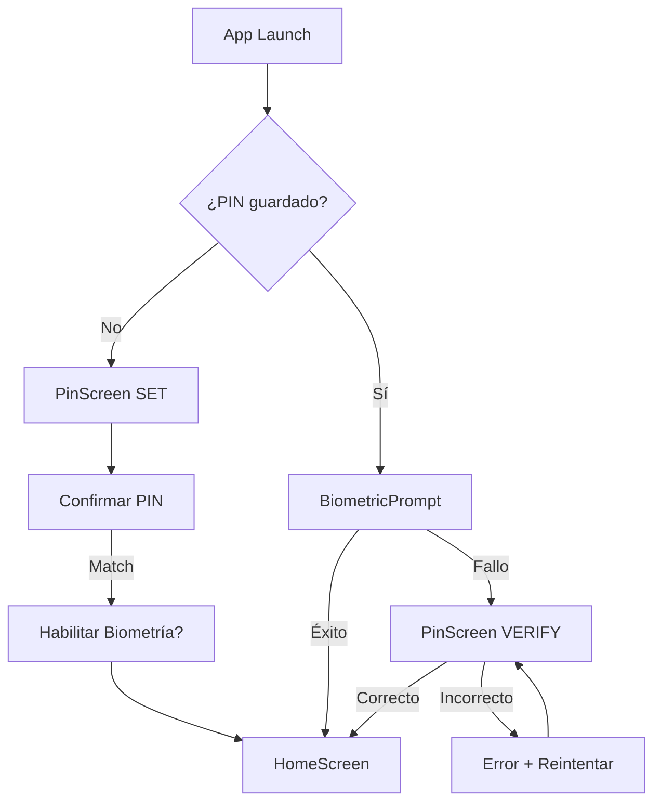

# Feature #12: PIN + Biometría

> **Issue:** [#23](https://github.com/monghithub/familitrack/issues/23) - PIN + Biometría
> **Estado:** Completada

## Descripción

Sistema de seguridad de dos niveles: PIN de 4 dígitos + autenticación biométrica (huella/rostro). Se almacena con SHA-256 en EncryptedSharedPreferences y se valida en cada apertura de la app. Permite saltar biometría si no está disponible.

## Componentes

| Archivo | Función |
|---------|---------|
| `PinScreen.kt` | UI con teclado numérico y validación |
| `PinViewModel.kt` | Estado y lógica de validación PIN |
| `BiometricHelper.kt` | Wrapper de BiometricPrompt |
| `SecurityRepository.kt` | Almacenamiento PIN en EncryptedSharedPreferences |
| `ApiDtos.kt` | DTOs para cambio de PIN (futura feature) |

## Captura Conceptual

```
PinScreen (Set):
┌─────────────────────────────────┐
│  Crear PIN de seguridad          │
│                                 │
│  Ingresa un PIN de 4 dígitos:    │
│  ●  ●  ●  ●                      │
│                                 │
│  ┌─ ─ ─ ─ ─ ─ ─┐               │
│  │ 1 │ 2 │ 3 │  │               │
│  ├───┼───┼───┤  │               │
│  │ 4 │ 5 │ 6 │  │               │
│  ├───┼───┼───┤  │               │
│  │ 7 │ 8 │ 9 │  │               │
│  ├───┴───┼───┤  │               │
│  │   0   │ ⌫ │  │               │
│  └───────┴───┘  │               │
│  Confirm        │               │
│  [CONFIRMAR]    │               │
└─────────────────────────────────┘

BiometricPrompt:
┌─────────────────────────────────┐
│  🔒 Autenticación biométrica    │
│                                 │
│  Usa tu huella o rostro         │
│                                 │
│  [Detectando...]               │
│                                 │
│  [Saltar]                      │
└─────────────────────────────────┘
```

## Características

### Teclado Numérico
- Grid 3x4 con números 0-9
- Botón retroceso (⌫) elimina último dígito
- Puntos visuales que se llenan al escribir
- Botón CONFIRMAR activado solo con 4 dígitos

### Almacenamiento Seguro
- PIN se hasheaa con SHA-256
- Se almacena en EncryptedSharedPreferences
- Key de encriptación derivada del PIN
- Nunca se guarda en plaintext

### Autenticación Biométrica
- BiometricPrompt nativa (minAPI 23)
- Soporta huella y reconocimiento facial
- Fallback a PIN si biometría falla
- Opción "Saltar" si no está disponible

## Flujo

```mermaid
sequenceDiagram
    participant APP as App Launch
    participant PIN as PinScreen
    participant SEC as SecurityRepository
    participant BIO as BiometricHelper
    participant ENC as EncryptedSharedPreferences

    APP->>SEC: isPinSet()?
    
    alt Primer uso
        SEC-->>APP: false
        APP->>PIN: Mostrar PinScreen(mode=SET)
        PIN->>PIN: Usuario ingresa 1234
        PIN->>SEC: savePinHash("1234")
        SEC->>ENC: PUT pin_hash = SHA256("1234")
        ENC-->>SEC: OK
        SEC-->>PIN: Guardado
        PIN->>BIO: enableBiometric()
        
    else Ya tiene PIN
        SEC-->>APP: true
        APP->>PIN: Mostrar PinScreen(mode=VERIFY)
        PIN->>BIO: Mostrar BiometricPrompt
        
        alt Biometría exitosa
            BIO->>PIN: success
            PIN->>APP: PIN verificado
            
        else Biometría falla
            BIO->>PIN: fallida/cancelada
            PIN->>PIN: Volver a mostrar teclado
            PIN->>SEC: verifyPin(userInput)
            SEC->>ENC: GET pin_hash
            ENC-->>SEC: SHA256("1234")
            SEC->>SEC: SHA256(userInput) == pin_hash?
            SEC-->>PIN: match=true/false
    end
```

## PinUiState

```kotlin
data class PinUiState(
    val mode: PinMode = PinMode.VERIFY, // VERIFY, SET, CHANGE
    val inputLength: Int = 0,
    val isLoading: Boolean = false,
    val error: String? = null,
    val success: Boolean = false,
    val biometricAvailable: Boolean = false
)

enum class PinMode {
    VERIFY,     // Verificar PIN al abrir app
    SET,        // Crear nuevo PIN
    CHANGE      // Cambiar PIN existente
}
```

## Almacenamiento

### EncryptedSharedPreferences
```kotlin
val encryptedSharedPreferences = EncryptedSharedPreferences.create(
    context,
    "secret_shared_prefs",
    MasterKey.Builder(context)
        .setKeyScheme(MasterKey.KeyScheme.AES256_GCM)
        .build(),
    EncryptedSharedPreferences.PrefKeyEncryptionScheme.AES256_SIV,
    EncryptedSharedPreferences.PrefValueEncryptionScheme.AES256_GCM
)

// Guardar PIN hasheado
val pinHash = pinInput.sha256()
encryptedSharedPreferences.edit().putString("pin_hash", pinHash).apply()

// Verificar PIN
val storedHash = encryptedSharedPreferences.getString("pin_hash", null)
val inputHash = userInput.sha256()
val match = storedHash == inputHash
```

## BiometricHelper

```kotlin
class BiometricHelper(private val activity: Activity) {
    fun authenticate(
        onSuccess: () -> Unit,
        onError: (String) -> Unit,
        onDismiss: () -> Unit
    ) {
        val biometricPrompt = BiometricPrompt(
            activity,
            executor,
            object : BiometricPrompt.AuthenticationCallback() {
                override fun onAuthenticationSucceeded(result: BiometricPrompt.AuthenticationResult) {
                    onSuccess()
                }
                override fun onAuthenticationError(errorCode: Int, errString: CharSequence) {
                    onError(errString.toString())
                }
                override fun onAuthenticationFailed() {
                    onDismiss()
                }
            }
        )
        
        val promptInfo = BiometricPrompt.PromptInfo.Builder()
            .setTitle("Desbloquear FamilyTrack")
            .setSubtitle("Usa tu huella o rostro")
            .setNegativeButtonText("Saltar")
            .build()
            
        biometricPrompt.authenticate(promptInfo)
    }
}
```

## Validaciones

| Paso | Validación |
|------|-----------|
| PIN Set | 4 dígitos exactos |
| PIN Verify | Hash coincide con almacenado |
| Biometría | Sistema disponible y enrolled |

## Navegación



## Dependencias

```gradle
// Biometric
implementation "androidx.biometric:biometric:1.1.0"

// Security
implementation "androidx.security:security-crypto:1.1.0-alpha06"

// SHA-256
implementation "org.bouncycastle:bcprov-jdk15on:1.70"
```

## Notas Técnicas

- SHA-256 se genera con `MessageDigest.getInstance("SHA-256")`
- BiometricPrompt soporta API 23+ pero requiere BiometricManager para verificar disponibilidad
- El salto de biometría es opcional y configurable
- El PIN no se puede recuperar si se olvida (necesita reinstalar app)
- Los reintentos fallidos no tienen límite (por UX)
