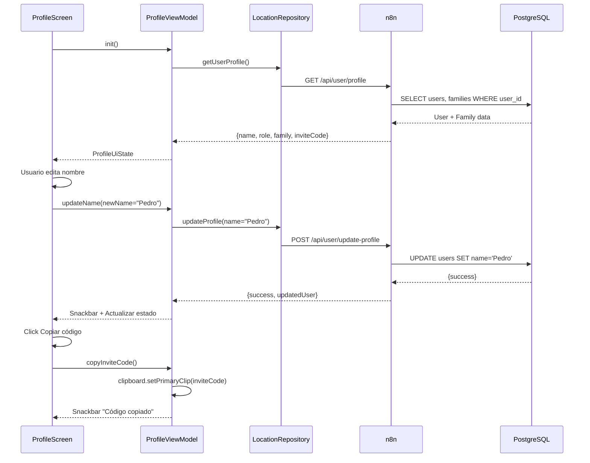
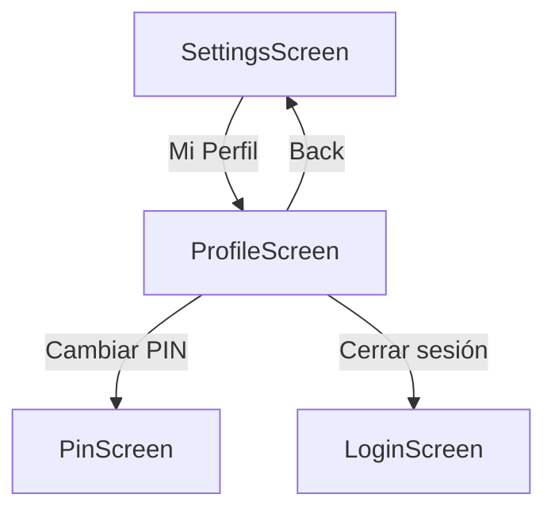

# Feature #13: Edición de Perfil

> **Issue:** [#24](https://github.com/monghithub/familitrack/issues/24) - Edición de perfil
> **Estado:** Completada

## Descripción

Pantalla de perfil que permite al usuario editar su nombre, ver su rol en la familia, copiar código de invitación y cambiar configuraciones de seguridad. Incluye cambio de nombre y acceso rápido al código para invitar otros miembros.

## Componentes

| Archivo | Función |
|---------|---------|
| `ProfileScreen.kt` | UI con formulario editable y campos informativos |
| `ProfileViewModel.kt` | Estado, cambios de perfil y validaciones |
| `ApiDtos.kt` | `UpdateProfileRequest/Response` |
| `ApiService.kt` | Endpoint `updateProfile()` |
| `LocationRepository.kt` | Método `updateProfile()` |

## Captura Conceptual

```
┌─────────────────────────────────┐
│  📱 Mi Perfil            ←       │
│                                 │
│  ┌──────────────────────────┐   │
│  │  👤                      │   │
│  │  Foto Perfil (opcional)  │   │
│  └──────────────────────────┘   │
│                                 │
│  Nombre:                        │
│  [Juan García ────────────────] │ (editable)
│  [GUARDAR]                      │
│                                 │
│  Mi Rol:                        │
│  👑 Admin (no editable)         │
│                                 │
│  Mi Familia:                    │
│  Familia García                 │
│                                 │
│  Código Invitación:             │
│  ABC123 [Copiar]                │
│                                 │
│  ─────────────────────────────  │
│  [Cambiar PIN]                  │
│  [Cambiar Contraseña]           │
│                                 │
└─────────────────────────────────┘
```

## Características

### Edición de Nombre
- TextField con validación (no vacío, max 100 chars)
- Botón GUARDAR que activa POST al backend
- Feedback visual de guardado exitoso
- Snackbar "Perfil actualizado"

### Información de Rol
- Badge de color según rol (Admin=Azul, Monitor=Verde, Monitoreado=Naranja)
- No es editable (se cambia desde otra interfaz)
- Muestra descripción del rol

### Información de Familia
- Nombre de la familia actual
- Botón para cambiar familia (futura feature)

### Código de Invitación
- Muestra el código actual de la familia
- Botón "Copiar" que copia a clipboard
- Snackbar "Código copiado"
- Botón "Compartir" que abre intent de compartir

### Enlaces a Otras Secciones
- Cambiar PIN
- Cambiar contraseña (si aplica)
- Cerrar sesión

## Flujo



## ProfileUiState

```kotlin
data class ProfileUiState(
    val name: String = "",
    val role: String = "", // admin, monitor, monitored
    val familyName: String = "",
    val inviteCode: String = "",
    val email: String = "",
    val isLoading: Boolean = true,
    val isUpdating: Boolean = false,
    val error: String? = null,
    val successMessage: String? = null
)
```

## API Endpoints

### Obtener Perfil

```json
GET /api/user/profile

Response:
{
    "userId": 1,
    "name": "Juan García",
    "email": "juan@example.com",
    "role": "admin",
    "familyId": 10,
    "familyName": "Familia García",
    "inviteCode": "ABC123"
}
```

### Actualizar Perfil

```json
POST /api/user/update-profile

Request:
{
    "userId": 1,
    "name": "Pedro García",
    "email": "pedro@example.com"
}

Response:
{
    "success": true,
    "userId": 1,
    "name": "Pedro García",
    "updatedAt": "2025-02-08T10:30:00Z"
}
```

## Campos Editables

| Campo | Tipo | Validación | Requerido |
|-------|------|-----------|----------|
| Nombre | String | 1-100 chars | Sí |
| Email | String | Válido RFC 5322 | No |
| Avatar | URI | JPG/PNG, max 2MB | No |

## Validaciones

| Campo | Regla |
|-------|------|
| Nombre | No vacío, máx 100 caracteres |
| Email | Formato válido o vacío |
| Avatar | JPG/PNG, máximo 2MB |

## Navegación



## Notas Técnicas

- La edición de perfil es optimista (actualiza UI inmediatamente)
- El código de invitación se copia al clipboard del sistema
- Si falla la actualización, se revierte el cambio
- El rol no se puede cambiar desde esta pantalla
- Las fotos se suben como base64 en requests (futura optimización: multipart)

