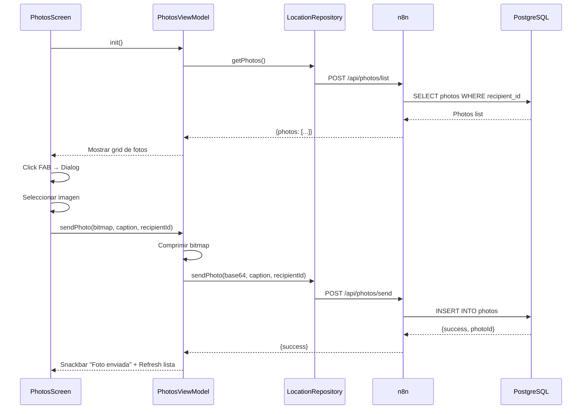
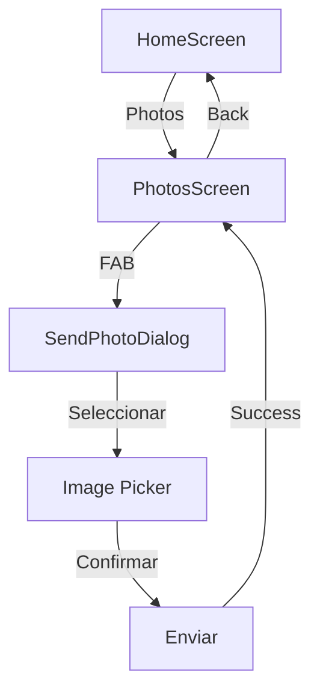

# Feature #14: Compartir Fotos

> **Issue:** [#25](https://github.com/monghithub/familitrack/issues/25) - Fotos familiares
> **Estado:** Completada

## Descripción

Sistema de intercambio de fotos entre miembros de la familia. Permite enviar fotos con captions/comentarios y ver un historial de fotos recibidas. Las fotos se comprimen y se envían en base64 al backend.

## Componentes

| Archivo | Función |
|---------|---------|
| `PhotosScreen.kt` | UI con galería de fotos recibidas y botón enviar |
| `PhotosViewModel.kt` | Estado, carga de fotos y envío |
| `ApiDtos.kt` | `SendPhotoRequest/Response`, `PhotosListResponse` |
| `ApiService.kt` | Endpoints `sendPhoto()`, `listPhotos()` |
| `LocationRepository.kt` | Métodos `sendPhoto()`, `getPhotos()` |

## Captura Conceptual

```
┌─────────────────────────────────┐
│  📸 Fotos Familiares      ➕     │
│                                 │
│  ┌──────────────┐               │
│  │              │               │
│  │   Foto 1     │  Hijo         │
│  │   07/02 14:30│  "En la playa" │
│  └──────────────┘               │
│                                 │
│  ┌──────────────┐               │
│  │              │               │
│  │   Foto 2     │  Madre        │
│  │   06/02 10:15│  "Almuerzo"   │
│  └──────────────┘               │
│                                 │
│  ┌──────────────┐               │
│  │              │               │
│  │   Foto 3     │  Padre        │
│  │   05/02 18:45│  "Parque"     │
│  └──────────────┘               │
│                                 │
└─────────────────────────────────┘

Send Dialog:
┌──────────────────────────────┐
│  Enviar Foto                  │
│                               │
│  Foto:                        │
│  [Seleccionar imagen] [📸]    │
│                               │
│  Comentario (opcional):       │
│  [_____________________]      │
│                               │
│  Para:                        │
│  [Todos    ▼]                 │
│                               │
│  [ENVIAR] [CANCELAR]          │
└──────────────────────────────┘
```

## Características

### Listado de Fotos
- Grid de 2 columnas con fotos recibidas
- Foto + nombre del remitente + caption + timestamp
- Pull-to-refresh para actualizar lista
- Estado vacío si no hay fotos

### Envío de Fotos
- Botón FAB (+) que abre dialog
- Selector de imagen (galería o cámara)
- Compresión automática (max 500px, quality 80%)
- Caption opcional (max 200 chars)
- Selector de destinatario (individual o grupal)
- Preview de foto seleccionada

### Estados
- Loading mientras se carga lista
- Vacio si no hay fotos
- Error con botón reintentar
- Enviando mientras se envía foto

## Flujo



## PhotosUiState

```kotlin
data class PhotosUiState(
    val photos: List<PhotoItem> = emptyList(),
    val isLoading: Boolean = true,
    val isRefreshing: Boolean = false,
    val isSending: Boolean = false,
    val error: String? = null,
    val successMessage: String? = null
)

data class PhotoItem(
    val photoId: Int,
    val fromUser: String,
    val caption: String,
    val photoBase64: String,
    val sentAt: String
)
```

## API Endpoints

### Enviar Foto

```json
POST /api/photos/send

Request:
{
    "userId": 1,
    "recipientId": 2,
    "photoBase64": "iVBORw0KGgoAAAANSUh...",
    "caption": "En la playa con los niños"
}

Response:
{
    "success": true,
    "photoId": 45,
    "sentAt": "2025-02-08T14:30:00Z"
}
```

### Listar Fotos

```json
POST /api/photos/list

Request:
{
    "userId": 1,
    "limit": 50
}

Response:
{
    "success": true,
    "photos": [
        {
            "photoId": 45,
            "fromUser": "Hijo",
            "photoBase64": "iVBORw0KGgoAAAANSUh...",
            "caption": "En la playa",
            "sentAt": "2025-02-08T14:30:00Z"
        }
    ]
}
```

## Compresión de Imágenes

```kotlin
fun compressImage(bitmap: Bitmap): String {
    val compressed = Bitmap.createScaledBitmap(
        bitmap,
        maxWidth = 500,
        maxHeight = 500,
        filter = true
    )
    
    val baos = ByteArrayOutputStream()
    compressed.compress(Bitmap.CompressFormat.JPEG, 80, baos)
    val bytes = baos.toByteArray()
    
    return Base64.getEncoder().encodeToString(bytes)
}
```

## Tabla photos

```sql
CREATE TABLE photos (
    id SERIAL PRIMARY KEY,
    from_user_id INT REFERENCES users(id),
    to_user_id INT REFERENCES users(id),
    photo_base64 LONGTEXT,
    caption VARCHAR(200),
    sent_at TIMESTAMP DEFAULT CURRENT_TIMESTAMP,
    is_viewed BOOLEAN DEFAULT false,
    viewed_at TIMESTAMP
);
```

## Validaciones

| Campo | Validación |
|-------|-----------|
| Imagen | JPG/PNG, máx 2MB |
| Caption | 0-200 caracteres |
| Destinatario | Usuario válido de la familia |

## Navegación



## Notas Técnicas

- Las fotos se comprimen a máximo 500px de ancho/alto
- Calidad JPEG al 80% para reducir tamaño
- Se envían en base64 (futura optimización: multipart/form-data)
- No hay almacenamiento local de fotos (siempre desde backend)
- Las fotos no se eliminan (histórico permanente)
- El visor de fotos puede ampliarse con gestos pinch-to-zoom

