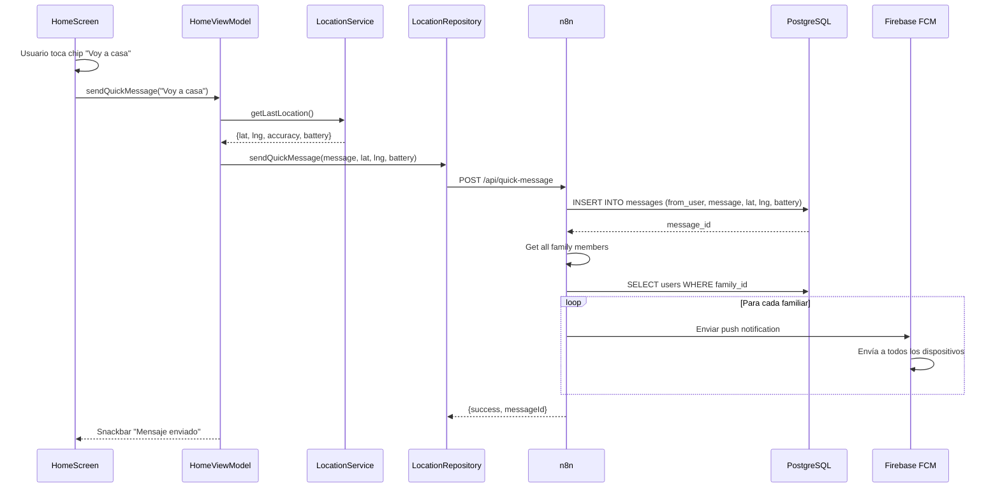

# Feature #15: Mensajes Rápidos

> **Issue:** [#26](https://github.com/monghithub/familitrack/issues/26) - Mensajes rápidos
> **Estado:** Completada

## Descripción

Sistema de mensajes predefinidos con envío instantáneo de ubicación. Incluye 5 chips rápidos (Voy para casa, Estoy ocupado, etc.) que envían automáticamente la ubicación actual del usuario. Ideal para notificaciones rápidas sin escribir.

## Componentes

| Archivo | Función |
|---------|---------|
| `HomeScreen.kt` | UI con chips de mensajes rápidos |
| `HomeViewModel.kt` | Envío de mensajes rápidos con ubicación |
| `ApiDtos.kt` | `QuickMessageRequest/Response` |
| `ApiService.kt` | Endpoint `sendQuickMessage()` |
| `LocationRepository.kt` | Método `sendQuickMessage()` |

## Captura Conceptual

```
┌─────────────────────────────────┐
│  🏠 Inicio                       │
│                                 │
│  Mi ubicación:                  │
│  📍 40.4168, -3.7038            │
│  Casa (100m)                    │
│                                 │
│  ─────────────────────────────  │
│                                 │
│  Mensajes rápidos:              │
│  ┌────────────────┐             │
│  │ 🏠 Voy a casa  │             │
│  └────────────────┘             │
│                                 │
│  ┌────────────────┐             │
│  │ 😴 Ocupado     │             │
│  └────────────────┘             │
│                                 │
│  ┌────────────────┐             │
│  │ 🎓 En el cole  │             │
│  └────────────────┘             │
│                                 │
│  ┌────────────────┐             │
│  │ 🏥 Médico      │             │
│  └────────────────┘             │
│                                 │
│  ┌────────────────┐             │
│  │ ⚽ Jugando      │             │
│  └────────────────┘             │
│                                 │
│  ─────────────────────────────  │
│                                 │
│  [🆘 SOS EMERGENCIA]            │
│                                 │
└─────────────────────────────────┘
```

## Características

### Chips Predefinidos
5 mensajes rápidos configurables:
1. **Voy a casa** (🏠) - Notifica que va rumbo a casa
2. **Ocupado** (😴) - Indica que no puede comunicarse
3. **En el colegio** (🎓) - Está en el colegio/trabajo
4. **En el médico** (🏥) - En cita médica
5. **Jugando** (⚽) - En actividad recreativa

Cada chip incluye:
- Emoji identificador
- Texto descriptivo
- Acción al tocar

### Envío Automático
- Captura ubicación actual en tiempo real
- Envía coordenadas + batería + timestamp
- Muestra loading mientras se envía
- Snackbar de confirmación: "Mensaje enviado a familia"

### Notificación Familiar
- Cada miembro recibe push notification
- Push contiene: nombre usuario + mensaje + ubicación
- Se almacena en tabla `messages` para historial

## Flujo



## QuickMessageData

```kotlin
data class QuickMessage(
    val id: Int,
    val messageType: String, // "home", "busy", "school", "doctor", "playing"
    val emoji: String,
    val text: String,
    val description: String
)

val QUICK_MESSAGES = listOf(
    QuickMessage(1, "home", "🏠", "Voy a casa", "Notifica que vas rumbo a casa"),
    QuickMessage(2, "busy", "😴", "Ocupado", "Indica que no puedes comunicarte"),
    QuickMessage(3, "school", "🎓", "En el colegio", "Estás en la escuela/trabajo"),
    QuickMessage(4, "doctor", "🏥", "En el médico", "En cita médica"),
    QuickMessage(5, "playing", "⚽", "Jugando", "En actividad recreativa")
)
```

## API Endpoint

### Enviar Mensaje Rápido

```json
POST /api/quick-message

Request:
{
    "userId": 1,
    "messageType": "home",
    "latitude": 40.4168,
    "longitude": -3.7038,
    "batteryLevel": 85,
    "accuracy": 12.5
}

Response:
{
    "success": true,
    "messageId": 567,
    "message": "Voy a casa",
    "notificationsSent": 4,
    "sentAt": "2025-02-08T14:30:00Z"
}
```

## Tabla messages

```sql
CREATE TABLE messages (
    id SERIAL PRIMARY KEY,
    from_user_id INT REFERENCES users(id),
    family_id INT REFERENCES families(id),
    message_type VARCHAR(50),
    message_text VARCHAR(255),
    latitude DECIMAL(10,6),
    longitude DECIMAL(10,6),
    battery_level INT,
    accuracy FLOAT,
    created_at TIMESTAMP DEFAULT CURRENT_TIMESTAMP
);
```

## UiState

```kotlin
data class HomeUiState(
    val currentLocation: Location? = null,
    val currentZone: String = "Ubicación desconocida",
    val batteryLevel: Int = 0,
    val familyMembers: List<FamilyMember> = emptyList(),
    val isSendingMessage: Boolean = false,
    val lastMessage: String? = null,
    val error: String? = null
)
```

## Configuración de Mensajes

Los mensajes rápidos pueden personalizarse en la app:

```kotlin
// En SettingsScreen (futura feature)
val customMessages = listOf(
    "Voy a casa",
    "En el parque",
    "Volviendo pronto",
    "¿Dónde estás?",
    "Llámame"
)
```

## Validaciones

| Campo | Validación |
|-------|-----------|
| Ubicación | Debe ser reciente (< 5 min) |
| Mensaje | Debe ser uno de los 5 predefinidos |
| Familia | Usuario debe pertenecer a familia |

## Navegación

HomeScreen muestra chips directamente, sin necesidad de navegación adicional.

## Notas Técnicas

- El envío es asincrónico pero muestra loading
- Se usa LocationManager para ubicación más rápida
- Si no hay ubicación reciente, se pide en tiempo real (puede tardar)
- Los mensajes se guardan en histórico de la familia
- El SOS (feature #17) es similar pero con prioridad máxima

